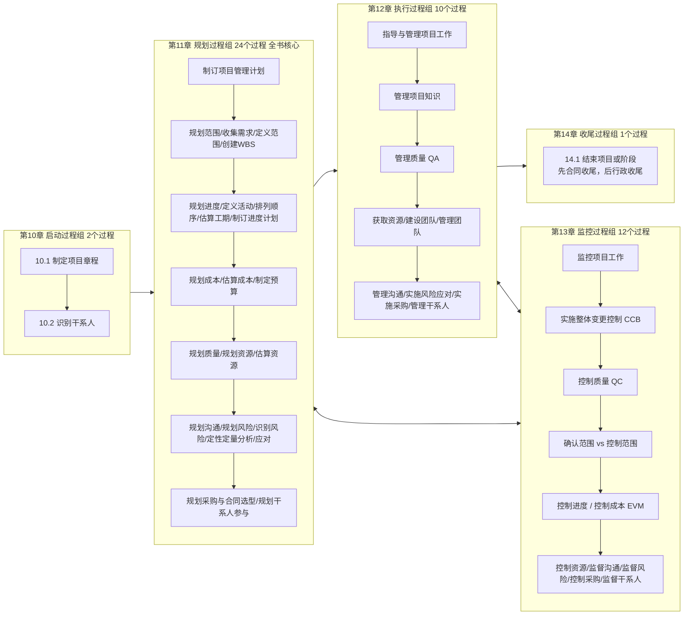

# 系统集成项目管理工程师（第3版）核心知识点通关速记手册 :id=main-title

> **编制说明**：本速记手册基于全国计算机技术与软件专业技术资格（水平）考试最新版统编教材《系统集成项目管理工程师教程（第3版）》（全书18章，616页）精编提炼，系统覆盖**新版技术体系、项目管理五大过程组、高频计算公式、案例分析答题套路与法律法规**，专为高效复习、考前突击与真题实战打造。

---

## 目录索引 :id=toc
- [第一部分：第3版新教材架构演变与命题规律分析](#part-1)
- [第二部分：IT与系统集成技术篇（第1章～第8章）](#part-2)
  - [第1章 信息化发展](#ch1)
  - [第2章 信息技术发展](#ch2)
  - [第3章 信息技术服务](#ch3)
  - [第4章 信息系统架构](#ch4)
  - [第5章 软件工程](#ch5)
  - [第6章 数据工程](#ch6)
  - [第7章 软硬件系统集成](#ch7)
  - [第8章 信息安全工程](#ch8)
- [第三部分：项目管理基础与立项（第9章）](#part-3)
  - [第9章 项目管理概论与立项](#ch9)
- [第四部分：五大过程组核心管理实务（第10章～第14章）](#part-4)
  - [第10章 启动过程组（2个过程）](#ch10)
  - [第11章 规划过程组（24个过程深度拆解）](#ch11)
  - [第12章 执行过程组（10个过程深度拆解）](#ch12)
  - [第13章 监控过程组（12个过程深度拆解）](#ch13)
  - [第14章 收尾过程组（1个过程深度拆解）](#ch14)
  - [📌 案例分析必背：三大生命周期演变流转链](#lifecycle-chains)
- [考前十页纸特辑：五大过程组 49 个过程完整 ITTO 极速通关总表](#itto-summary)
  - [启动过程组（2个过程 ITTO 表）](#itto-initiating)
  - [规划过程组（24个过程 ITTO 表）](#itto-planning)
  - [执行过程组（10个过程 ITTO 表）](#itto-executing)
  - [监控过程组（12个过程 ITTO 表）](#itto-monitoring)
  - [收尾过程组（1个过程 ITTO 表）](#itto-closing)
- [第五部分：组织保障、监理、法规与道德（第15章～第18章）](#part-5)
  - [第15章 组织保障（配置管理与变更管理）](#ch15)
  - [第16章 监理基础知识](#ch16)
  - [第17章 法律法规和标准规范](#ch17)
  - [第18章 职业道德规范](#ch18)
- [专题特辑：项目管理与质量管理核心图表全景解析（图文深度详解）](#core-charts)
  - [一、因果图（鱼骨图 / 石川图）](#chart-fishbone)
  - [二、帕累托图（排列图）](#chart-pareto)
  - [三、控制图与失控判异准则](#chart-control)
  - [四、挣值分析（EVM）走势图与绩效判断](#chart-evm)
  - [五、单代号网络图（PDM）与六标时法](#chart-cpm)
  - [六、干系人权力 / 利益方格](#chart-stakeholder)
  - [七、项目成本预算自下而上层级汇聚图](#chart-budget)
  - [八、质量管理“老七种”与“新七种”工具对比](#chart-quality7)
- [第六部分：高频计算题公式库与解题技巧（必拿满分）](#part-6)
  - [1. 关键路径法（CPM）与时差计算](#calc-cpm)
  - [2. 三点估算（PERT 公式）](#calc-pert)
  - [3. 挣值分析（EVM）核心指标与预测速查表](#calc-evm)
- [第七部分：案例分析“找茬+纠偏”万能答题模板](#part-7)
  - [1. 进度落后/成本超支的补救措施](#case-schedule-cost)
  - [2. 变更管理失控的标准纠错话术](#case-change-control)

---

## 第一部分：第3版新教材架构演变与命题规律分析 :id=part-1

### 1. 教材结构升级对比
| 对比维度 | 第2版（老版教材） | 第3版（新版统编教材） | 考生备考应对重点 |
| :--- | :--- | :--- | :--- |
| **章节与体量** | 22章，约655页 | **18章，616页** | 体系更加凝练，淘汰陈旧技术，突出最新标准 |
| **技术体系** | 传统IT、老式网络与数据库、简单信息化 | **全面引入数字中国“2522”框架、新基建、数据工程、云原生微服务、信创、元宇宙** | 上午选择题中新增现代IT概念分值约占 20~25 分，重在抓定义、特征与分类 |
| **项目管理编排** | 按“十大知识领域”分章 | **以“五大过程组”为主干（第10~14章）**，各大领域具体过程融合在各过程组中 | 搞清各过程在生命周期中的先后承接顺序，案例题侧重考查过程组横向协同 |
| **现代管理理念** | 传统预测型（瀑布式）为主 | **融入价值交付系统、敏捷开发（Scrum）、PMBOK 7代12大原则** | 案例与选择题更加贴近实际项目情境，避免死记硬背 |

### 2. 考试分值权重分析与通关线
- **科目一：基础知识（单选 75 题，满分 75 分，45 分及格）**
  - 技术部分（第1~8章）：约 **20~25 分**（概念题为主，多考记忆与分类）。
  - 管理部分（第9~14章）：约 **35~40 分**（核心大头，概念、过程输入输出、工具技术）。
  - 支撑与法规（第15~18章）：约 **10~15 分**（配置管理、变更管理、招投标法、著作权法）。
  - 英语题（最后 5 题）：**5 分**（多为项目管理基础术语与前沿IT名词）。
- **科目二：应用技术（案例分析 4 题，满分 75 分，45 分及格）**
  - **第1题：计算题（20~25分，通关命脉）**：关键路径 CPM、总时差自由时差、三点估算、EVM 挣值分析（CV, SV, CPI, SPI, EAC, ETC）。
  - **第2题：变更与配置管理（15~20分，极高频）**：CCB 流程、基线建立、版本控制、配置库（开发/受控/产品库）、配置审计。
  - **第3题：质量 / 范围 / 进度综合找茬与措施题（15~20分）**。
  - **第4题：人力资源 / 沟通 / 干系人 / 风险 / 合同采购管理（15~20分）**。

---

## 第二部分：IT与系统集成技术篇（第1章～第8章） :id=part-2

### 第1章 信息化发展 :id=ch1
1. **信息基本属性**：客观性（本质特征）、普遍性、无限性、动态性、相对性、依附性（必须以某种物质为载体）、变换性、传递性、层次性、系统性、转化性。
2. **信息系统生命周期**：
   - **四阶段划分**：产生阶段（概念与立项） → 开发阶段（需求分析 → 概要/详细设计 → 编码实现 → 测试） → 运行阶段（系统维护与持续运营） → 消亡阶段。
   - **简化五阶段**：系统规划 → 系统分析 → 系统设计 → 系统实施 → 系统运行和维护。
3. **国家信息化体系六要素（核心必背口诀：“上鹰下鸡，左手抓人，右手抓法，中间一网络”）**：
   - **信息资源**：核心和基础，开发利用信息资源是信息化的核心任务。
   - **信息网络**：基础设施（电信网、广播电视网、互联网）。
   - **信息技术应用**：龙头和主阵地，信息化建设的出发点和落脚点。
   - **信息技术和产业**：物质技术基础。
   - **信息化人才**：成功之本，决定性因素。
   - **信息化政策法规和标准规范**：根本保障。
4. **新型基础设施建设（新基建三类特征）**：
   - **信息基础设施（“技术新”）**：以 5G、物联网、工业互联网为代表的通信网络；以人工智能、云计算、区块链为代表的新技术；以数据中心、智能计算中心为代表的算力基础设施。
   - **融合基础设施（“应用新”）**：深度应用互联网、大数据、人工智能等技术，支撑传统基础设施转型升级（如智能交通、智慧能源）。
   - **创新基础设施（“平台新”）**：支撑科学研究、技术开发、产品研制的具有公益属性的基础设施。
5. **工业互联网平台体系四大支柱**：
   - **网络是基础**：构建人、机、物全面互联的网络基础设施。
   - **平台是中枢**：汇聚工业海量数据与工业知识模型，提供算力与开发环境。
   - **数据是要素**：以数据流动化解不确定性，驱动工业智能化创新。
   - **安全是保障**：构建设备、网络、控制、应用、数据多维安全防护屏障。
6. **两化融合核心**：
   - 以信息化带动工业化，以工业化促进信息化，走新型工业化道路。
   - **核心本质**：**信息化支撑，追求可持续发展模式**，从传统要素驱动转向数据驱动与创新驱动。
7. **数字经济“四化”整体框架**：
   - **数字产业化**：电子信息制造业、电信业、软件和信息技术服务业等核心产业。
   - **产业数字化**：传统工农商产业应用数字技术降本增效（数字经济主战场）。
   - **数字化治理**：运用数字技术创新治理模式，提升公共服务效能。
   - **数据价值化**：数据资源化、数据资产化、数据要素化，释放数据要素乘数效应。
8. **数字政府核心内容与智慧城市能力要素**：
   - **数字政府主要内容**：“**一网通办**”（政务服务全流程网上办）、“**跨省通办**”（打破属地壁垒）、“**一网统管**”（城市运行态势一屏感知与协同联动）。
   - **智慧城市五大核心能力要素**：**数据治理**、**数字孪生**、**边际决策**、**多元融合**、**态势感知**。
9. **数字中国“2522”整体框架**：
   - **“2”大基础**：打通数字基础设施大动脉、畅通数据资源大循环。
   - **“5”位一体**：赋能数字经济、数字政务、数字文化、数字社会、数字生态文明。
   - **“2”大能力**：强化数字技术创新体系、构筑数字安全屏障。
   - **“2”个环境**：优化数字化发展国内环境、拓展数字领域国际合作。

---

### 第2章 信息技术发展 :id=ch2
1. **OSI 七层参考模型与关键协议**：
   - **物理层**：传输比特流；网卡、集线器、中继器。
   - **数据链路层**：传输数据帧，识别物理 MAC 地址；交换机、网桥；ARP、RARP、PPP、HDLC。
   - **网络层**：分组/包传输，路由寻址，逻辑 IP 地址；路由器；IP、ICMP、IGMP、OSPF、BGP。
   - **传输层**：端到端报文段传输；**TCP（面向连接、可靠、流量与拥塞控制）**，**UDP（无连接、不可靠、速度快、低开销）**。
   - **会话层 / 表示层**：建立管理会话；数据格式转换、加密解密、压缩解压缩。
   - **应用层**：HTTP/HTTPS、FTP、SMTP、POP3/IMAP、DNS、DHCP、Telnet。
2. **新一代信息技术核心特性速记**：
   - **物联网（IoT）三层架构**：
     - **感知层**：识别物体、采集信息（RFID、传感器、二维码、GPS）。
     - **网络层**：传递和处理信息（移动通信网、互联网、卫星网）。
     - **应用层**：信息处理与人机交互（智慧城市、智能农业、车联网）。
   - **云计算（Cloud Computing）**：
     - 服务模式：**IaaS（基础设施即服务）**提供虚机/存储/网络；**PaaS（平台即服务）**提供操作系统、中间件、数据库环境；**SaaS（软件即服务）**直接面向最终用户的应用（如CRM、企业邮箱）。
     - 部署模式：公有云、私有云、混合云、社区云。
   - **大数据（Big Data）5V 特性**：
     - Volume（大量）、Velocity（高速）、Variety（多样）、Value（低价值密度）、Veracity（真实性）。
   - **区块链（Blockchain）**：
     - 特征：分布式去中心化、防篡改、全程留痕、可追溯、集体维护。
     - 核心机制：密码学哈希函数、非对称加密、共识机制（PoW工作量证明、PoS权益证明、DPoS）、智能合约。
   - **人工智能（AI）**：
     - 三大核心驱动力：**数据、算法、算力**。

---

### 第3章 信息技术服务 :id=ch3
1. **IT服务原理能力四要素（PPTR 模型）**：
   - **人员（People）**：知识、技能、经验、资质与角色职责分工。
   - **过程（Process）**：服务流程规范化，明确活动、输入、输出与流转机制。
   - **技术（Technology）**：技术手段、监控诊断工具、运维自动化平台。
   - **资源（Resource）**：服务工具、备品备件库、知识库、服务台、运维基础设施。
2. **服务产业化三大演进阶段**：
   - **产品服务化**：传统产品制造厂商向提供衍生服务转变（如从销售设备转向提供运维与支持服务）。
   - **服务标准化**：将非标准化人工服务转化为统一、规范、可度量的服务形态（如制定服务目录、服务级别协议 SLA）。
   - **服务产品化**：将标准化服务打包成可独立计价、可复制、可规模化销售交付的完整服务商品。
3. **IT服务质量五大核心特性（必考选择题！）**：
   - **安全性**：保障客户数据机密性、完整性，防范非授权访问与安全事故。
   - **可靠性**：服务持续稳定无故障，达到约定 SLA 可用性承诺。
   - **响应性**：及时感知和快速响应客户诉求，排障时效高。
   - **有形性**：专业人员形象、规范的服务文档、透明的报告等外在展现。
   - **友好性**：态度谦和、沟通高效，带给客户良好的交互体验。
4. **服务集成四大核心要素**：
   - **需方**：服务的提出者、采购者与最终受益主体。
   - **供方**：服务的承建者、交付者与运维保障主体。
   - **环境**：支撑服务开展的软硬件环境、网络平台、法律政策与业务运行生态。
   - **过程**：连接需方与供方，涵盖规划、交付、运营与持续优化的端到端活动流程。
5. **IT服务生命周期（PIOIS）与 ITSS 标准**：
   - **规划设计（Plan）** → **部署实施（Implement）** → **服务运营（Operate）** → **持续改进（Improve）** → **监督管理（Supervise，贯穿始终）**。
   - **ITSS（信息技术服务标准）**：规范 IT 服务组织能力成熟度模型，SLA（服务级别协议）是核心交付考核依据。

---

### 第4章 信息系统架构 :id=ch4
1. **系统架构分类与常用模型**：
   - **架构分类**：**集中式架构**（资源集中、管控紧密但存在单点性能瓶颈与容灾风险） vs **分布式架构**（高可用、易横向扩展但分布式事务与通信复杂度高）。
   - **常用架构模型**：单机应用模式、客户端/服务器（C/S与B/S）模式、面向服务架构（SOA）模式、组织级数据交换总线（ESB）等。
2. **信息系统三大架构设计核心原则（高频核心考点）**：
   - **应用架构 5 原则**：
     1. **业务适配性原则**：应用体系必须高度贴合组织业务战略与实际业务流程。
     2. **应用聚合化原则**：高度相关的业务功能聚合为独立应用模块，避免过度碎片化。
     3. **功能专业化原则**：模块职责单一明确，具备独立演进能力。
     4. **风险最小化原则**：控制系统复杂性与跨模块依赖，隔离潜在故障蔓延。
     5. **资产复用化原则**：最大限度复用已有的成熟软件资产、组件与中台能力。
   - **数据架构 5 原则**：
     1. **数据分层原则**：按操作数据层（ODS）、明细层（DWD）、汇总层（DWS）、应用层（ADS）分层治理。
     2. **数据处理效率原则**：根据业务时效选择批处理或流式计算，优化查询与写入性能。
     3. **数据一致性原则**：保证跨业务系统流转中的全局数据唯一性与语义一致。
     4. **数据架构可扩展性原则**：满足海量数据激增与多元新型数据格式的存储计算拓展。
     5. **服务于业务原则**：以业务决策分析、价值赋能为数据归集加工的根本导向。
   - **技术架构 5 原则**：
     1. **成熟度控制原则**：优先选用经过生产环境长期验证、社区活跃度高的成熟技术栈。
     2. **技术一致性原则**：制定统一的技术标准规范与选型白名单，降低技术维护与团队协作成本。
     3. **局部可替换原则**：采用松耦合设计，使得单个组件或子系统能够平滑替换而不牵动全局。
     4. **人才技能覆盖原则**：技术选型必须与组织现有或易于招聘的工程师技能储备相匹配。
     5. **创新驱动原则**：在风险受控前提下积极拥抱云原生、人工智能等前沿技术驱动变革。
3. **WPDRRC 网络安全动态防御模型**：
   - 六大动态闭环环节：
     - **预警（W - Warning）**：基于情报与行为分析，提前预警潜在威胁。
     - **保护（P - Protect）**：配置安全策略、访问控制与加密防护。
     - **检测（D - Detect）**：实时监测异常入侵与越权行为。
     - **响应（R - Response）**：突发安全事件发生时的应急处置与止血隔离。
     - **恢复（R - Recover）**：快速恢复受损系统与核心业务数据。
     - **反击（C - Counterattack）**：攻击源取证、溯源追踪与反制打击。
4. **云原生架构（Cloud Native）四大基石**：
   - **容器化（Containers）**：标准化轻量级打包与隔离（Docker/K8s）。
   - **微服务（Microservices）**：业务拆分细粒度自闭环。
   - **服务网格（Service Mesh）**：非侵入式网络通信与流量管控（Sidecar模式，如 Istio）。
   - **声明式 API 与 DevOps**：自动化 CI/CD 持续交付与配置驱动。

---

### 第5章 软件工程 :id=ch5
1. **需求分类**：
   - **业务需求**：组织高层目标与投资意图。
   - **用户需求**：用户通过系统完成的具体任务。
   - **系统需求**：功能需求、非功能需求（性能、安全、易用性、可靠性）、设计约束。
2. **经典开发模型对比**：
   - **瀑布模型**：阶段严格串行，文档驱动，适用于需求极其明确且不易变更的项目。
   - **V模型**：把测试与分析设计对应起来，单元测试对应详细设计，集成测试对应概要设计，系统测试对应需求分析，验收测试对应用户需求。
   - **原型模型**：适用于需求不明确、用户缺乏经验的场景，快速构建演示。
   - **螺旋模型**：融合瀑布模型与原型模型，**以风险分析与评估为核心**，适合庞大、复杂、高风险项目。
   - **敏捷模型（Scrum）**：迭代增量，响应变化。角色（PO/SM/Team），仪式（Sprint计划/每日站会/评审/回顾），工件（产品待办/迭代待办/燃尽图）。
3. **软件测试与质量**：
   - **黑盒测试**：不看内部源码，仅测功能输入输出（等价类划分、边界值分析、错误推测、因果图）。
   - **白盒测试**：基于内部代码逻辑结构（语句覆盖、判定覆盖、条件覆盖、路径覆盖）。

---

### 第6章 数据工程 :id=ch6
1. **数据预处理五种典型情况**：
   - **数据缺失**：采用均值填充、插值法、模型预测或直接丢弃空值行。
   - **数据异常**：通过箱线图、3σ准则过滤离群极端值。
   - **数据不一致**：消除不同来源对同一实体属性的冲突（如性别使用 0/1 与 M/F 的矛盾）。
   - **数据重复**：基于主键或多字段哈希剔除重复录入数据。
   - **数据格式不符**：统一日期时间格式、度量衡单位与字符串编码。
2. **常见三大数据备份策略对比（选择题必考）**：
   | 备份策略 | 备份内容定义 | 备份速度 | 恢复速度 | 磁盘存储空间开销 |
   | :--- | :--- | :---: | :---: | :---: |
   | **完全备份（Full Backup）** | 备份指定系统的全部数据 | 最慢 | 最快（只需最近一次全备） | 最大 |
   | **差异备份 / 差分备份（Differential Backup）** | 仅备份自**上次完全备份**以来发生变化的所有数据 | 较快 | 较快（只需上次全备 + 最近一次差备） | 适中 |
   | **增量备份（Incremental Backup）** | 仅备份自**上次备份（无论全备或增量）**以来变化的数据 | 最快 | 最慢（需上次全备 + 期间所有增量连续回放） | 最小 |
3. **三大类数据模型与常见逻辑模型**：
   - **模型层次**：**概念模型**（如 E-R 实体关系图，面向用户需求建模） → **逻辑模型**（面向 DBMS 建模） → **物理模型**（面向底层硬件存储结构建模）。
   - **常见五大逻辑模型**：
     - **层次模型**：树状结构，有且仅有一个根节点，子节点只有一个父节点。
     - **网状模型**：图状结构，允许多个父节点与无父节点。
     - **关系模型**：二维表格结构，当前业界绝对主流模型。
     - **面向对象模型**：支持封装、继承与多态的对象机制。
     - **对象关系模型**：在传统关系数据库上融合面向对象特性。
4. **数据脱敏两大类别**：
   - **可恢复类脱敏**：基于可逆加密/解密算法规则处理，具备特定解密权限在合法授权环境下可无损还原原值。
   - **不可恢复类脱敏**：通过替换算法（字典置换）、生成算法（伪随机生成合规数据）、屏蔽掩码（手机号/身份证掩星号）处理，原敏感信息彻底损毁，不可逆向还原。
5. **数据治理关键要素**：
   - 数据战略规划、数据治理组织、数据标准管理（统一元数据）、数据质量管理（真实性、完整性、一致性）、数据安全合规、数据生命周期管理（采集 → 存储 → 处理 → 共享 → 销毁）。

---

### 第7章 软硬件系统集成 :id=ch7
1. **综合布线系统六大子系统**：
   - 工作区子系统（终端插座到电脑）
   - 配线（水平）子系统（楼层配线架到各信息插座）
   - 干线（垂直）子系统（主设备间到各楼层配线间）
   - 设备间子系统（网络中心主机房）
   - 管理子系统（配线架与跳线管理区域）
   - 建筑群子系统（连接多栋建筑物之间的室外线缆）
2. **三种网络存储技术比拼**：
   - **DAS（直连存储）**：服务器内部总线直接挂载，成本低，无法共享。
   - **NAS（网络附加存储）**：局域网共享，通过 NFS/CIFS 协议，**文件级（File Level）**共享，性能受以太网带宽制约。
   - **SAN（存储区域网络）**：专用的高速网络（光纤 FC 或 IP iSCSI），**块级（Block Level）**访问，速度快、可靠性极高，适用于高并发大型数据库。

---

### 第8章 信息安全工程 :id=ch8
1. **网络安全等级保护 2.0（GB/T 22239）威胁源防御分级（高频必背）**：
   - **第1级（用户自主保护级）**：能够防护免受来自**个人的、拥有很少资源**的威胁源发起的恶意攻击。
   - **第2级（系统审计保护级）**：能够防护免受来自**外部小型组织的、拥有少量资源**的威胁源发起的恶意攻击。
   - **第3级（安全标记保护级）**：能够防护免受来自**外部有组织的团体、拥有较为丰富资源**的威胁源发起的恶意攻击（地市级以上重要政务、金融、电信核心系统）。
   - **第4级（结构化保护级）**：能够防护免受来自**国家级别的、敌对组织的、拥有丰富资源**的威胁源发起的恶意攻击（涉及国家安全、国计民生极其重要的核心系统）。
   - **第5级（访问验证保护级）**：最高级别，防御来自国家级顶级战略力量的极限攻击。
2. **信息安全系统安全机制立体构成**：
   - 涵盖基础设施安全、平台安全、数据安全、通信安全、应用安全、运行安全、管理安全、授权和审计安全、安全防范体系。
3. **信息安全 CIA 三要素与扩展属性**：
   - **机密性（Confidentiality）**：确保信息不暴露给未经授权的实体。
   - **完整性（Integrity）**：保护信息不被未授权篡改或伪造。
   - **可用性（Availability）**：确保授权用户在需要时能够正常访问。
   - 扩展属性：不可抵赖性（抗抵赖）、真实性、可核查性。
2. **密码技术**：
   - **对称加密**：加解密同一密钥（DES, 3DES, AES, 国密 SM4）。优点是速度极快，适合海量数据加密。
   - **非对称加密**：公钥加密私钥解密（或私钥签名公钥验证）（RSA, ECC, 国密 SM2）。解决密钥分发难题，但速度慢。
   - **数字摘要（哈希算法）**：单向不可逆、定长输出、抗碰撞（MD5, SHA-256, 国密 SM3）。
   - **数字签名**：发送方用自己的**私钥**加密摘要，接收方用发送方的**公钥**解密验证，防抵赖、防篡改、验证身份。
3. **网络安全等级保护 2.0（五级划分）**：
   - 第一级：自主保护级（损害用户合法权益，不损害国家安全）。
   - 第二级：指导保护级（损害公共利益，但不危害国家安全）。
   - **第三级：监督保护级（极大损害公共利益，或危害国家安全——中级考试最常考的及格底线级）**。
   - 第四级：强制保护级（严重危害国家安全）。
   - 第五级：专控保护级（特别严重危害国家安全）。

---

## 第三部分：项目管理基础与立项（第9章） :id=part-3

4. **信息安全系统工程能力成熟度模型（ISSE-CMM / SSE-CMM）深度全解（教材第 295~302 页）**：

   

   - **基本概念与理论基础**：
     - ISSE-CMM（也常称 SSE-CMM）是一种**衡量信息安全系统工程实施能力的方法**，是建立在**统计过程控制理论**基础之上的。
     - **核心思想**：认为所有成功组织的共同特点是拥有一整套**严格定义、管理完善、可测可控**的有效业务过程。模型抽取了一组安全业界“最好的实施（Best Practices）”，指导安全工程的完善和改进，使安全工程成为一个清晰定义的、成熟的、可度量的学科。
   - **三大适用组织（选择题常考考点）**：
     1. **工程组织（Engineering Organizations）**：系统集成商、应用开发商、产品提供商和服务商（用于工程能力的**自我评估**与改进）。
     2. **获取组织（Acquiring Organizations）**：采购方、业主单位与最终用户（用于**评判供应者的安全工程能力**与产品系统的可信任度）。
     3. **评估组织（Evaluation Organizations）**：第三方认证机构、系统授权与评估组织（作为建立被评组织**整体能力信任度**的工作基准）。

   - **信息安全系统工程实施过程的三大组成部分（必背考点，单选第 5 题真题原考题！）**：
     ```
     ┌─────────────────────────────────────────────────────────┐
     │           信息安全系统工程实施过程 (三大有机组成)         │
     ├──────────────────┬──────────────────┬───────────────────┤
     │   1. 工程过程    │   2. 风险过程    │    3. 保证过程    │
     │(Engineering Proc)│  (Risk Process)  │(Assurance Process)│
     │ 确定需求/实施控制│ 识别量化安全风险 │ 建立安全方案可信度│
     │ 输出：产品或服务 │ 输出：风险信息   │ 输出：保证论据    │
     └──────────────────┴──────────────────┴───────────────────┘
     ```
     1. **工程过程（Engineering Process）**：贯穿概念、设计、实现、测试、部署、运行、维护、退出的全生命周期。强调**安全工程是整个大项目工程团队不可分割的一部分**，与其他工程活动紧密协同。
     2. **风险过程（Risk Process）**：调查和量化风险，降低系统运行危害。
        - **有害事件三要素**：由**威胁（Threat）、脆弱性（Vulnerability）和影响（Impact）** 3 个部分组成（若不存在脆弱性和威胁，则不存在有害事件与风险）。
        - **风险态度**：安全措施可减轻风险，但**绝不可能根除所有威胁**，必须在组织承受限度内**接受残留风险（Residual Risk）**。
     3. **保证过程（Assurance Process）**：指安全需求得到满足的**可信程度**。
        - **关键内涵**：安全保证**并不能增加任何额外的对安全相关风险的抵抗能力，但它能为减少预期安全风险提供信心**（信心来自于安全措施及其部署的正确性与有效性）。

   - **ISSE-CMM 两维体系结构（体系结构设计核心）**：
     - **第一维：域维（Domain）/ 过程域（Process Areas, PA）**：
       - 汇集了所有安全实施活动（由 60 个**基本实施 Base Practices, BP** 构成）。
       - 划分为 **22 个过程域（PA）**：
         - **11 个安全工程过程域**：PA01 实施安全控制、PA02 评估影响、PA03 评估安全风险、PA04 评估威胁、PA05 评估脆弱性、PA06 建立保证论据、PA07 协调安全、PA08 监控安全态、PA09 提供安全输入、PA10 确定安全需求、PA11 验证和证实安全。
         - **11 个项目和组织实施过程域**：PA12 保证质量、PA13 管理配置、PA14 管理项目风险、PA15 监测和控制技术工程项目、PA16 规划技术工程项目、PA17 定义组织的系统工程过程、PA18 改进组织的系统工程过程、PA19 管理产品线的演变、PA20 管理系统工程支持环境、PA21 提供不断更新的技能和知识、PA22 与供应商的协调。
     - **第二维：能力维（Capability）/ 公共特性（Common Features）与通用实施（GP）**：
       - 代表组织过程管理和制度化能力，按成熟性分级排序。

   - **能力级别的 5 级成熟度模型（教材表 8-3，核心背诵清单）**：
     | 成熟度等级 | 级别名称 | 核心重点 | 能力特征与核心金句 |
     | :--- | :--- | :--- | :--- |
     | **Level 1** | **非正规实施级**<br>(Informally Performed) | 着重于组织或项目只是**执行了包含基本实施的过程**。 | **“必须首先做它，然后才能管理它”**。<br>过程临时、无条理、缺乏规划和跟踪，全凭个人直觉。 |
     | **Level 2** | **规划与跟踪级**<br>(Planned & Tracked) | 着重于**项目层面**的定义、规划和执行问题。规范化执行、验证执行与跟踪执行。 | **“在定义组织层面的过程之前，先要弄清楚与项目相关的事项”**。<br>工作产品处于版本控制和配置管理之下。 |
     | **Level 3** | **充分定义级**<br>(Well-Defined) | 着重于**规范化地裁剪组织层面的过程定义**。定义标准化过程、执行已定义过程、协调安全实施。 | **“用项目中学到的最好的东西来定义组织层面的过程”**。<br>形成了组织级标准过程族，并可在项目中合理裁剪。 |
     | **Level 4** | **量化控制级**<br>(Quantitatively Controlled) | **着重于测量**。建立可测度的质量目标，对执行情况实施客观量化管理。 | **“只有知道它是什么，才能测量它；当被测量的对象正确时，基于测量的管理才有意义”**。<br>过程能力得到统计量化控制。 |
     | **Level 5** | **持续改进级**<br>(Continuously Improving) | 强调**组织文化的转变**，通过因果分析消除缺陷产生的根本原因，不断提高效能。 | **“持续性改进的文化需要以完备的管理实施、已定义的过程和可测量的目标作为基础”**。 |

   - **口诀速记**：**“一非二规三充分，四量五持进”**（1级非正规、2级规与跟、3级充分定、4级量化控、5级持续改）。

   - **高频对比：ISSE-CMM vs 软件能力成熟度模型 CMMI 跨界辨析**：
     | 对比维度 | ISSE-CMM (系统安全工程能力成熟度模型) | CMMI (能力成熟度模型集成 - 软件工程) |
     | :--- | :--- | :--- |
     | **专注领域** | **信息系统安全工程（兼顾工程、风险与安全保证）** | **软件与系统研发项目管理及过程改进** |
     | **级别名称** | **1.非正规实施级 → 2.规划与跟踪级 → 3.充分定义级 → 4.量化控制级 → 5.持续改进级** | **1.初始级 → 2.已管理级 → 3.已定义级 → 4.量化管理级 → 5.优化级** |
     | **级别数量** | 5 级 | 5 级（阶段式模型 1~5 级） |
     | **2级重点区别** | 强调“**项目层面的规划与跟踪**” | 强调“**项目级受管理，解决项目级混乱**” |
     | **3级重点区别** | 强调“**裁剪组织层面过程族，建立充分定义过程**” | 强调“**组织级标准化与已定义资产库**” |
     | **4级重点区别** | 强调“**建立可测度的质量目标，数据在组织层面应用**” | 强调“**建立过程绩效基线与统计过程控制**” |
     | **5级重点区别** | 强调“**组织文化转变与主动因果分析防缺陷**” | 强调“**关注技术创新与增量持续优化**” |

---

### 第9章 项目管理概论与立项 :id=ch9
1. **项目概念与典型特征**：
   - **临时性**：项目有明确的起点和终点。**注意**：临时性并不一定意味着项目的持续时间短，许多项目历时数年甚至更久，但其终有明确的关闭收尾时刻。
   - **独特性**：创造独特的可交付成果、服务或技术资产。
   - **渐进明细性**：随着项目推进与信息增加，目标、计划与指标越来越清晰准确。
2. **项目运行环境与两大支柱**：
   - **事业环境因素（EEF）**：项目团队不可控的内部或外部制约因素（如组织文化、政府法规、基础设施现状、市场条件、人员能力水平）。
   - **组织过程资产（OPA）**：组织积累的有形与无形资产，可直接借鉴与复用（如流程规范、模板、历史项目经验教训库、财务数据库）。
3. **PMO（项目管理办公室）三种类型对比（必考选择题）**：
   | PMO 类型 | 角色定位 | 职权与支持内容 | 对项目的控制程度 |
   | :--- | :--- | :--- | :---: |
   | **支持型（Supportive）** | 顾问顾问角色 | 提供项目模板、最佳实践、专业培训，充当项目资源库 | **低** |
   | **控制型（Controlling）** | 监督治理角色 | 不仅提供支持，还要求项目必须服从既定治理框架、使用特定管理工具与合规模板 | **中等** |
   | **指令型（Directive）** | 全面主导掌控 | 直接管理和掌控项目，项目经理由 PMO 直接指定并向 PMO 汇报工作 | **高** |
4. **项目生命周期的三种开发方法**：
   - **预测型（瀑布型）**：在开发早期即全部明确定义范围、时间和成本，适用于需求极其稳定成熟的场景。
   - **迭代型与增量型**：需求在交付期间通过一系列固定的迭代周期定期细化和递增交付。
   - **适应型（敏捷型）**：需求在交付期间频繁细化，通过快速轻量迭代响应持续的市场与用户反馈变更。
5. **项目可行性研究三大原则与五大核心内容**：
   - **详细可行性研究三大原则**：**科学性原则**、**客观性原则**、**公正性原则**。
   - **五大核心内容**：技术可行性分析、经济可行性分析、社会效益可行性分析、运行环境可行性分析、其他方面的可行性分析（法律、政策、风险等）。
2. **组织结构形态横向比对表（选择题必考！）**：
   | 组织形态 | 项目经理权力 | 典型全职人员比例 | 谁控制项目预算 | 核心优缺点 |
   | :--- | :--- | :--- | :--- | :--- |
   | **职能型** | 很少或几乎没有 | 接近 0% | 职能部门经理 | 技术专家集中，但项目优先级低、跨部门沟通困难 |
   | **弱矩阵** | 很小（项目联络员/协调员） | < 25% | 职能部门经理 | 兼顾部门运作，但项目经理没有决策权 |
   | **平衡矩阵** | 中等偏低 | 15%~60% | 混合控制 | 平衡资源，但双重领导易生冲突 |
   | **强矩阵** | 较大到很高 | 50%~95% | **项目经理** | 项目目标明确，对客户响应快，资源争夺多 |
   | **项目型** | **极高乃至全权** | 85%~100% | **项目经理** | 统一指挥，效率极高，但团队缺乏长期安全感 |
3. **项目立项管理三步法**：
   - **第一步：项目建议书（立项申请）**：核心说明“为什么要做”，包括建设必要性、业务需求、市场预测、初步可行性说明。
   - **第二步：可行性研究**：
     - 阶段递进：**机会研究**（粗略） → **初步可行性研究** → **详细可行性研究**（核心输出，投资估算误差须在 $\pm 10\%$ 以内）。
     - 核心内容：技术可行性、经济可行性（静态/动态投资回收期、净现值NPV、内部收益率IRR）、组织运行环境可行性、法律法规可行性。
   - **第三步：项目评估与论证**：
     - 原则：“先论证，后决策”。
     - 区别：**论证**是承办单位自身的论证；**评估**是第三方权威机构或投资方主持的全面审核。

---

## 第四部分：五大过程组核心管理实务（第10章～第14章） :id=part-4

> **备考战略核心**：在全国计算机技术与软件专业技术资格考试（中级系统集成）中，**五大过程组（第10～14章）占全卷总分值的 60% 以上**！下午的案例分析 4 道大题，90% 以上的问题直接源自规划、执行与监控这三大过程组。本章将对第 11 章（24个规划过程）、第 12 章（10个执行过程）、第 13 章（12个监控过程）进行**地毯式系统拆解**，全面厘清 ITTO 骨架、核心工具技术与案例找茬采分点。



---

### 第10章 启动过程组（2个过程） :id=ch10

#### 1. 制定项目章程（Develop Project Charter）
- **核心定义**：正式批准项目成立，并授权项目经理动用组织资源开展项目活动的法定文件。
- **关键输入**：立项管理文件（商业论证、可行性研究报告）、协议/合同、事业环境因素（EEF）、组织过程资产（OPA）。
- **主要输出**：**项目章程**。
  - **核心内容 10 大要素**：①项目目的；②可测量的项目目标与成功标准；③高层级需求；④高层级项目描述与边界；⑤总体里程碑进度；⑥预先批准的财务资源（高层级预算）；⑦整体项目风险；⑧关键干系人名单；⑨**项目经理委派及其权责**；⑩**项目发起人或其他批准章程的人员姓名与职权（由高层签署发布，绝非项目经理自己批）**。
- **项目启动会（Kick-off Meeting）**：项目章程签署后召开，标志着项目正式动工，旨在宣告项目目标、介绍关键干系人、明确团队职责并获取各方承诺。

#### 2. 识别干系人（Identify Stakeholders）
- **核心定义**：定期识别项目干系人，分析其利益、参与度、相互依赖性、影响力和潜在成功影响。
- **关键工具**：**权力/利益方格（Power/Interest Grid）**（参见专题特辑图解）。
- **主要输出**：**干系人登记册（Stakeholder Register）**（记录干系人的身份信息、评估信息、干系人分类）。

---

### 第11章 规划过程组（24个过程地毯式深度拆解） :id=ch11

#### 11.1 制订项目管理计划（Develop Project Management Plan）
- **地位**：规划过程组的总纲和顶层设计，定义、准备和协调所有子计划并整合为一份综合计划。
- **构成（10个子计划 + 3大基准）**：
  - **子计划**：范围管理计划、需求管理计划、进度管理计划、成本管理计划、质量管理计划、资源管理计划、沟通管理计划、风险管理计划、采购管理计划、干系人参与计划。
  - **3 大基准（核心受控基准）**：**范围基准、进度基准、成本基准**（合称**绩效测量基准 PMB**）。
- **案例必考辨析**：项目管理计划**不是项目经理一人闭门造车写出来的**，必须经过项目团队、核心干系人充分研讨，并经**管理层/发起人/客户正式评审审批后才生效**。生效后的基准修改必须走 CCB 变更程序！

#### 11.2 规划范围管理（Plan Scope Management）
- **输出**：
  - **范围管理计划**：规定如何制定、监督、控制和确认项目范围。
  - **需求管理计划**：规定如何分析、记录、跟踪和管理产品需求。

#### 11.3 收集需求（Collect Requirements）
- **核心工具与技术（选择题高频考点）**：
  - **访谈（Interviews）**：与干系人一对一直接交流，获取保密信息。
  - **焦点小组（Focus Groups）**：召集受邀干系人与主题专家（SME），由主持人引导讨论，比一对一访谈更具互动性。
  - **引导式研讨会（Facilitated Workshops）**：跨职能核心干系人共同参与（如 JAD/QFD），快速跨界达成共识。
  - **群体创新技术**：
    - **头脑风暴（Brainstorming）**：发散思维、畅所欲言、不评价好坏。
    - **名义小组技术（Nominal Group Technique）**：在头脑风暴基础上增加**投票打分与优先级排序**。
    - **德尔菲技术（Delphi Technique）**：**匿名专家多轮问卷反馈**，避免权威主导与光环效应。
    - **亲和图（Affinity Diagram）**：大量创意按相关性分组归类（KJ法）。
  - **群体决策技术**：一致同意（Unanimity）、大多数原则（>50%）、相对多数原则（得票最多）、独裁（一人拍板）。
  - **观察法（Observation）**：“工作影子”，深入一线观察实际操作，挖掘隐性需求。
  - **原型法（Prototyping）**：快速构建可交互模型，直观展示并渐进明细需求。
  - **标杆对照（Benchmarking）**：对比内外部优秀实践，寻找差距设定标准。
- **主要输出**：
  - **需求文件**：描述需求如何满足业务导向。
  - **需求跟踪矩阵（RTM）**：**把每个需求连接到业务目标和可交付成果的跟踪表格**，确保每个需求都有交付物支撑，**有效防范范围蔓延与镀金**！

#### 11.4 定义范围（Define Scope）
- **核心输出**：**项目范围说明书（Project Scope Statement）**。
  - **核心要素（必背找茬点）**：
    1. **产品范围描述**：产品、服务或成果的特征；
    2. **验收标准**：成果被客户接受的指标；
    3. **可交付成果**：包含项目管理产出与最终产品；
    4. **项目的除外责任（边界边界）**：明确说明**哪些不属于本项目范围**，防止客户过度索求；
    5. **制约因素**：预先确定的预算上限、硬性工期截点、法定合规要求；
    6. **假设条件**：在规划时视为真实、确定的潜在因素。

#### 11.5 创建工作分解结构（Create WBS）
- **定义**：把项目可交付成果和项目工作分解成较小的、更易于管理的组成部分。
- **核心原则与规范**：
  - **100% 原则**：WBS 必须包含且仅包含项目 100% 的工作（既不漏项，也不多加未批准的镀金工作）。
  - **最底层为工作包（Work Package）**：工作包应遵循 **8/80 原则**（完成一个工作包所需时间在 8 到 80 工时之间）。
  - **控制账户（Control Account）**：高层管理控制点，把范围、预算和实际成本结合起来测量绩效（一个控制账户可包含多个工作包，但每个工作包只属于一个控制账户）。
  - **WBS 字典**：详细描述 WBS 每个组件的文件（包括工作包代码、工作描述、责任人、验收标准、资源需求、成本估算）。
- **主要输出**：**范围基准（Scope Baseline）**。
  - **范围基准 3 大支柱** = **批准的项目范围说明书 + WBS + WBS 字典**。

#### 11.6 规划进度管理（Plan Schedule Management）
- **输出**：**进度管理计划**（规定进度模型制定方法、准确度、计量单位、控制临界值、绩效测量规则）。

#### 11.7 定义活动（Define Activities）
- **核心工具**：
  - **分解**：将工作包进一步细分为具体的进度“活动”。
  - **滚动式规划（Rolling Wave Planning）**：**“近细远粗”**的渐进明细技术，近期工作详细拆解，远期工作暂留在高层级。
- **输出**：**活动清单、活动属性、里程碑清单**（里程碑是重大事件，**工期持续时间为 0，不消耗资源**）。

#### 11.8 排列活动顺序（Sequence Activities）
- **逻辑紧前关系（PDM 前导图法）**：
  - **FS（完成-开始，Finish-to-Start）**：紧前活动完成，紧后活动才能开始（最普遍）。
  - **SS（开始-开始，Start-to-Start）**：紧前活动开始，紧后活动才能开始。
  - **FF（完成-完成，Finish-to-Finish）**：紧前活动完成，紧后活动才能完成。
  - **SF（开始-完成，Start-to-Finish）**：紧前活动开始，紧后活动才能完成（极少见）。
- **4 种依赖关系属性**：
  - **强制性依赖（硬逻辑）**：法律或物理客观规律决定的顺序（如先打地基后建墙）。
  - **选择性依赖（软逻辑/最佳实践）**：团队主观推荐的执行次序。
  - **外部依赖关系**：项目活动与外部第三方活动之间的依赖（如等待政府许可证发放）。
  - **内部依赖关系**：项目内部团队掌控的活动间关系。
- **提前量（Lead）与滞后量（Lag）**：提前量使紧后活动提前开始（负时间），滞后量使紧后活动推迟（正时间）。

#### 11.9 估算活动持续时间（Estimate Activity Durations）
- **估算工具精要**：
  - **类比估算**：拿过去相似项目的实际历史数据作参照。**速度快、成本低，但准确性最差**（适合项目早期信息不足时）。
  - **参数估算**：利用历史数据与变量之间的数学统计关系计算（如单价 $\times$ 数量、每平米工日）。精度高于类比。
  - **三点估算（PERT）**：考虑不确定性与风险，用悲观 $P$、最可能 $M$、乐观 $O$ 加权平均：
    $$T_e = \frac{O + 4M + P}{6}, \quad \sigma = \frac{P - O}{6}$$
  - **自下而上估算**：从底层活动或工作包分别逐个估算再往上汇总。**最精确、耗时最长、成本最高**。

#### 11.10 制订进度计划（Develop Schedule）
- **核心工具与算法**：
  - **关键路径法（CPM）**：正推求最早（ES, EF），逆推求最迟（LS, LF），时差计算（$TF=LS-ES, FF=\min(ES_{\text{紧后}})-EF$）。
  - **关键链法（CCM）**：基于有限资源约束，在网络末端设置**项目缓冲（Project Buffer）**，在汇聚路径设置**接驳缓冲（Feeding Buffer）**。
  - **资源优化技术（必考对比！）**：
    | 对比维度 | 资源平衡（Resource Leveling） | 资源平滑（Resource Smoothing） |
    | :--- | :--- | :--- |
    | **核心目的** | 解决资源过度分配或资源冲突 | 使资源需求均匀，不超过预定资源限额 |
    | **工期影响** | **往往会导致关键路径改变，延长项目总工期** | **不会改变关键路径，总工期保持不变** |
    | **时差利用** | 活动时差被打破 | 只在自由时差和总时差范围内调整非关键活动 |
  - **进度压缩技术（必考对比！）**：
    | 对比维度 | 赶工（Crashing） | 快速跟进（Fast Tracking） |
    | :--- | :--- | :--- |
    | **实施方式** | 加班、增加人手、追加高效设备 | 将原本串行顺序的活动改为**并行（重叠）施工** |
    | **代价与风险** | **增加项目成本**，边际效应递减 | **增加返工风险和质量缺陷**，增大协调难度 |
- **输出**：**进度基准（Schedule Baseline）**、项目进度计划（甘特图/横道图展示概况、里程碑图向高层汇报、网络图分析逻辑路径）。

#### 11.11 规划成本管理（Plan Cost Management）
- **输出**：**成本管理计划**（计量单位、精确度、控制临界值、EVM 计算规则）。

#### 11.12 估算成本（Estimate Costs）
- **成本分类常考点**：
  - **直接成本**：直接归属于本项目的成本（项目人员工资、差旅、外购专用软件）。
  - **间接成本**：多个项目分摊的公共成本（公司房租、水电、行政财务费用）。
  - **固定成本**：不随工作量变化的成本（房租、设备折旧）；**可变成本**：随工作量变动（耗材、外包工时）。
  - **沉没成本**：过去已发生、无法收回的成本（决策时不应受其干扰！）；**机会成本**：放弃其他备选方案带来的潜在最高收益。
- **储备分析（核心辨析）**：
  - **活动应急储备**：应对“已知-未知”风险，包含在活动成本和工作包中。

#### 11.13 制定预算（Determine Budget）
- **编制流程**：活动成本估算 → 汇总工作包 → 汇总控制账户 → 加应急储备 = **成本基准（S曲线）** → 加管理储备 = **项目总预算**（参见专题特辑图解）。
- **资金限制平衡（Funding Limit Reconciliation）**：根据客户或组织的阶段性拨款上限，平滑工作支出。

#### 11.14 规划质量管理（Plan Quality Management）
- **工具技术**：
  - **成本效益分析**：比较质量投入成本与所获得的收益（高一致性带来更少返工、更高满意度）。
  - **质量成本（COQ, Cost of Quality）**：
    - **一致性成本**：**预防成本**（培训、流程优化、设备维护） + **评估成本**（测试、审查、巡检）。
    - **非一致性成本**：**内部失败成本**（返工、报废、废品） + **外部失败成本**（质保赔偿、客户退款、诉讼罚金）。
  - **实验设计（DOE）**：统计学方法，确定哪些变量对整个产品或过程的输出结果影响最大。
- **主要输出**：**质量管理计划**、**质量测量指标（Quality Metrics）**（如缺陷率、系统响应时间 $\le 2$ 秒、代码单元覆盖率 $\ge 85\%$）。

#### 11.15 规划资源管理（Plan Resource Management）
- **组织结构与职责图表**：
  - **层次结构图**：OBS（组织分解结构，展示部门与项目对应关系）、RBS（资源分解结构，按类别和类型展现资源）。
  - **责任分配矩阵（RAM / RACI 矩阵）**：Responsible（负责执行）、Accountable（最终批准/负责，**每项工作只有1人**）、Consulted（咨询）、Informed（知会）。
- **输出**：资源管理计划、**团队章程（Team Charter）**（团队自我制定的核心价值观、沟通守则、冲突处理指南与工作准则）。

#### 11.16 估算活动资源（Estimate Activity Resources）
- **输出**：资源需求清单、资源分解结构（RBS）。

#### 11.17 规划沟通管理（Plan Communications Management）
- **沟通渠道数计算**：$M = \frac{N(N - 1)}{2}$（增加一个新干系人时，渠道净增加 $N$ 个）。
- **沟通模型要素**：发送方 → 编码 → 传递媒介 → 解码 → 接收方（噪声干扰全程存在；包含“确认接收”与“反馈回答”）。
- **沟通方式分类（必考！）**：
  - **交互式沟通（Interactive）**：实时双向互动（面对面交谈、电话会议、即时通讯讨论）。
  - **推式沟通（Push）**：发送给特定受众，不保证对方已读或理解（电子邮件、新闻稿、工作绩效报告）。
  - **拉式沟通（Pull）**：信息量极大时，由受众自主访问下载（公司内网门户、共享知识库、电子看板）。

#### 11.18 规划风险管理（Plan Risk Management）
- **输出**：**风险管理计划**（确定风险分类 RBS、风险概率和影响定义、风险承受力阈值）。

#### 11.19 识别风险（Identify Risks）
- **核心原则**：**全员参与、贯穿项目全生命周期**，风险随时随地都有可能新生。
- **工具技术**：头脑风暴、德尔菲匿名法、访谈、根本原因分析、**SWOT 分析（优势 S、劣势 W、机会 O、威胁 T）**、核对单分析。
- **输出**：**风险登记册（Risk Register）**（记录已识别风险清单、潜在责任人、初步应对策略）。

#### 11.20 实施定性风险分析（Perform Qualitative Risk Analysis）
- **核心目的**：评估风险发生的概率和影响程度，对风险进行**优先级排序**。
- **工具**：**概率和影响矩阵（P-I 矩阵）**、风险数据质量评估（确保数据真实客观）、风险紧迫性评估。

#### 11.21 实施定量风险分析（Perform Quantitative Risk Analysis）
- **核心工具**：
  - **敏感性分析（龙卷风图 Tornado Diagram）**：分析哪项不确定因素对项目目标具有最大潜在影响，横条按影响由大到小倒金字塔排列。
  - **期望货币价值分析（EMV）与决策树**：
    $$\text{EMV} = \sum (P_i \times V_i) = \sum (\text{概率} \times \text{净收益或损失})$$
  - **蒙特卡洛模拟（Monte Carlo Simulation）**：借助计算机大量迭代运算，输出概率分布曲线（计算达成某个工期或预算的累积置信概率）。

#### 11.22 规划风险应对（Plan Risk Responses）
- **消极风险（威胁）应对策略 4 大招（必考！）**：
  - **规避（Avoid）**：彻底改变计划，消除威胁（如取消高风险模块开发、更换成熟供货商）。
  - **转移（Transfer）**：将风险后果责任转交第三方（买商业保险、签订固定总价合同、外包给有资质服务商）。
  - **减轻（Mitigate）**：降低风险发生的概率或减轻损失（如关键模块增加双人代码审查、提前做性能压测）。
  - **接受（Accept）**：主动接受（建立应急储备）或被动接受（出现问题时由权变措施处置）。
- **积极风险（机会）应对策略 4 大招**：
  - **开拓（Exploit）**：消除不确定性，确保机会百分之百实现（派最顶尖专家确保中标）。
  - **提高（Enhance）**：提高机会发生的概率或积极影响（多加广告争取提前上线）。
  - **分享（Share）**：与第三方合作建立合资实体，共享收益（联合投标）。
  - **接受（Accept）**：乐见其成，不主动追求。
- **衍生概念**：
  - **残余风险**：执行应对措施后仍然遗留的微小风险。
  - **次生风险**：由于实施了某种风险应对措施而直接引发的新风险。
  - **弹回计划（Fallback Plan）**：当主要应对策略证实无效时执行的备用应对方案。

#### 11.23 规划采购管理（Plan Procurement Management）
- **自制或外购分析（Make-or-Buy Analysis）**：决定是内部自研还是向外部供应商采购。
- **合同类型全景横向比对（核心考点，年年必考！）**：
  | 合同大类 | 细分类型 | 适用场景与特征 | 买方风险 | 卖方风险 |
  | :--- | :--- | :--- | :--- | :--- |
  | **总价合同** | **固定总价（FFP）** | 需求规格极其明确、范围完全确定 | **最小** | **最大** |
  | | **总价加激励费用（FPIF）** | 设定目标成本、目标利润、最高限价与分摊比例 | 中等偏低 | 较高 |
  | | **总价加经济价格调整（FPEA）**| 跨期多年，允许按汇率、通胀物价指数调价 | 中等偏低 | 较高 |
  | **成本补偿合同** | **成本加固定费用（CPFF）** | 探索性研发，买方报销全部合法成本，额外付固定利润 | 很高 | 极小 |
  | | **成本加激励费用（CPIF）** | 买卖双方按比例（如 80/20）共担节约或超支 | 较高 | 中等 |
  | | **成本加奖励费用（CPAF）** | 买方根据主观绩效指标判定是否给予额外奖金 | 较高 | 极小 |
  | **工料合同** | **工料合同（T&M）** | 按预定人工单价与材料实耗计价；短期应急借调 | 混合风险 | 混合风险 |
- **采购文件**：采购管理计划、采购工作说明书（SOW）、招标文件（RFI 信息邀请书、RFP 建议邀请书、RFQ 报价邀请书）、供方选择标准。

#### 11.24 规划干系人参与（Plan Stakeholder Engagement）
- **干系人参与度评估矩阵**：
  - 5 类状态：不知晓（Unaware）、抗拒（Resistant）、中立（Neutral）、支持（Supportive）、领导（Leading）。
  - 矩阵通过标出干系人**当前参与水平（C）**与**期望参与水平（D）**，制定引导其转变的针对性策略。

---

### 第12章 执行过程组（10个过程深度拆解） :id=ch12

#### 12.1 指导与管理项目工作（Direct and Manage Project Work）
- **地位**：按项目管理计划带领团队执行具体工作，直接产出成果。
- **关键输出（核心数据起点！）**：
  - **可交付成果（Deliverables）**：为完成项目而必须产出的独特产品或成果。
  - **工作绩效数据（Work Performance Data）**：**在执行活动过程中收集到的原始观察结果与度量值**（如实际花费了 50 万元、实际完成了 30% 工作量、发现了 15 个 Bug）。
  - **问题日志（Issue Log）**：记录未解决的冲突与障碍，指定责任人跟踪解决。
  - **变更请求（Change Requests）**：纠正措施、预防措施、缺陷补救。

#### 12.2 管理项目知识（Manage Project Knowledge）
- **知识类型辨析**：
  - **显性知识（Explicit Knowledge）**：能够用文字、图表、数字直接表达并轻松共享的知识（如操作手册、代码文档）。
  - **隐性知识（Tacit Knowledge）**：个人头脑中的信念、洞察力、诀窍和经验，极难被直接编码。
- **主要输出**：**经验教训登记册（Lessons Learned Register）**（在整个项目期间持续记录并更新，收尾时归入组织过程资产）。

#### 12.3 管理质量（Manage Quality，即 QA 质量保证）
- **核心定义**：把通用质量方针转化为可执行的质量活动，确保项目执行了既定的质量标准和规范。
- **QA 与 QC 辨析（必考！）**：
  - **管理质量（QA）**：**针对“过程”**，重在审核质量要求、分析过程缺陷、推动持续改进，建立对质量的信心。
  - **控制质量（QC）**：**针对“结果/产品”**，重在检验最终可交付成果是否符合特定规格。
- **核心工具**：**质量审计（Quality Audit）**（结构化、独立的外部或内部审查，识别差距与违规操作，输出质量改进建议）。

#### 12.4 获取资源（Acquire Resources）
- **工具技术**：谈判（与职能经理协商借人）、预分派（在项目章程或投标书中已指派）、虚拟团队（跨地域协同）。
- **输出**：物质资源分配单、项目团队派工单、**资源日历（Resource Calendar）**（明确指出某个人员或设备何时可以参与项目）。

#### 12.5 建设团队（Develop Team）
- **核心目标**：提高团队工作技能，增进团队成员之间的协同信任，提升整体绩效。
- **塔克曼阶梯团队发展阶段与项目经理风格**：
  1. **形成阶段（Forming）**：成员互不熟悉，试探摸索。PM 宜采用**指导型（Directing）**。
  2. **震荡阶段（Storming）**：观念冲突、权力争夺、抵触规则。PM 宜采用**教练型/影响型（Coaching）**。
  3. **规范阶段（Norming）**：建立默契，遵守规则，开始协作。PM 宜采用**支持型/参与型（Supporting）**。
  4. **发挥阶段（Performing）**：默契运转，自主解决问题，效率巅峰。PM 宜采用**授权型（Delegating）**。
  5. **解散阶段（Adjourning）**：项目收尾，释放成员。
- **输出**：**团队绩效评价（Team Performance Assessments）**。

#### 12.6 管理团队（Manage Team）
- **核心内容**：跟踪团队成员绩效、提供反馈、解决问题并管理团队内部人际变更。
- **冲突处理 5 大策略深度对照**：
  1. **合作 / 解决问题（Collaborating / Problem Solving）**：综合各方观点，面对面研讨，**达成双赢（Win-Win），最佳解决方式**！
  2. **妥协 / 调解（Compromising / Reconciling）**：双方各让一步，寻找折中方案，暂时缓解矛盾。
  3. **强迫 / 命令（Forcing / Directing）**：利用职权强推一方意见，形成**赢-输（Win-Lose）**局面，适用于紧急关头。
  4. **缓和 / 包容（Smoothing / Accommodating）**：强调共同点，淡化分歧，求同存异维持表面和谐，治标不治本。
  5. **撤退 / 回避（Withdrawing / Avoiding）**：推迟问题处理，搁置争议，输-输（Lose-Lose）。
- **项目经理的 5 种权力来源**：
  - 职位/合法权力（Legitimate）、奖励权力（Reward）、强制/惩罚权力（Coercive）、**专家权力（Expert，最具说服力）**、**感召/潜照权力（Referent，人格魅力）**。

#### 12.7 管理沟通（Manage Communications）
- **核心动作**：收集、生成、分发、存储和检索项目信息。
- **输出**：项目沟通记录、项目管理计划更新。

#### 12.8 实施风险应对（Implement Risk Responses）
- **核心动作**：确保按规划的风险应对方案执行应对措施，落实责任人，分配资源。

#### 12.9 实施采购（Conduct Procurements）
- **核心工具与流程**：
  - **投标人会议（Pre-bid Conference）**：保证所有潜在供应商**在同等条件下获得完全一致的答疑信息**，严禁私下透露。
  - **独立估算（标底）**：买方自行编制基准成本，以评估卖方报价合理性。
  - **采购谈判**：就合同条款、价格、技术要求达成一致。
- **输出**：**选定的卖方**、**签订的正式合同（具有法律约束力）**。

#### 12.10 管理干系人参与（Manage Stakeholder Engagement）
- **核心动作**：与干系人进行沟通协作以满足其需要与期望，处理问题，促进其积极参与。
- **输出**：变更请求、问题日志更新、干系人参与计划更新。

---

### 第13章 监控过程组（12个过程深度拆解） :id=ch13

#### 13.1 监控项目工作（Monitor and Control Project Work）
- **地位**：贯穿始终的综合性监控过程。收集、测量并分析实际绩效数据，与基准比较，预测未来趋势。
- **输出**：**工作绩效报告（Work Performance Reports）**（将工作绩效信息整理成状态报告、进展报告、EVM 走势图，供高层和 CCB 决策）。

#### 13.2 实施整体变更控制（Perform Integrated Change Control，全书最高频考点！）
- **地位**：审查所有变更请求、批准变更，并管理可交付成果、组织过程资产、计划和基准的变更。
- **变更控制委员会（CCB）**：由关键干系人代表组成的正式团体，**负责审查、评价、批准、推迟或否决项目变更**。
- **标准变更控制 7 步法（案例大题标准得分骨架，见本手册第七部分万能模板）**。

#### 13.3 确认范围（Validate Scope）vs 13.4 控制范围（Control Scope）
- **确认范围**：
  - **输入**：**核实的可交付成果（Verified Deliverables）**（已经过 QC 质检合格的成果）。
  - **输出**：**验收的可交付成果（Accepted Deliverables）**（客户或发起人正式书面签字接收）。
  - **核心区别**：确认范围重在**“客户外部验收（接受度）”**；控制质量重在**“内部技术检验（正确性）”**。
- **控制范围**：
  - 监督范围基准状态，坚决防止**范围蔓延（Scope Creep，未经控制和批准的需求扩张）**和**镀金（Gold Plating，团队自作主张额外添加的不必要功能）**。

#### 13.5 控制进度（Control Schedule）
- **核心工具**：
  - 关键路径法性能跟踪、趋势分析、偏差分析（$SV, SPI$）。
  - 采取赶工、快速跟进等纠偏手段调整进度基准。
- **输出**：进度预测（Schedule Forecasts）、变更请求。

#### 13.6 控制成本（Control Costs）
- **核心工具**：**挣值分析（EVM）与完工预测**（详见本手册第六部分完整公式库）。
- **完工尚需绩效指数（TCPI）**：
  - 基于原计划 BAC 预算达成：$TCPI = \frac{BAC - EV}{BAC - AC}$
  - 基于新批准 EAC 预测达成：$TCPI = \frac{BAC - EV}{EAC - AC}$
  - $TCPI > 1$ 说明未来工作必须提升效率才能完成，难度加大；$TCPI < 1$ 说明未来工作有空间保持从容。

#### 13.7 控制质量（Control Quality，即 QC 质量控制）
- **核心工具**：检验（Inspection）、软件测试（单元/集成/系统测试）、老七种与新七种质量工具（控制图、帕累托图等）。
- **主要输出**：
  - **质量控制测量结果**。
  - **核实的可交付成果（Verified Deliverables）**（为确认范围提供直接输入）。

#### 13.8 控制资源（Control Resources）
- **核心动作**：确保项目所需实物资源（设备、材料、机房）按时按量到位，并在使用完毕后及时释放。

#### 13.9 监督沟通（Monitor Communications）
- **核心动作**：按沟通管理计划评估沟通效果，确保干系人的信息需求在最佳时间得到满足。

#### 13.10 监督风险（Monitor Risks）
- **核心工具**：
  - **风险审计（Risk Audit）**：检查并记录风险应对措施在处理已识别风险方面的有效性，以及评估风险管理过程的有效性。
  - **储备分析（Reserve Analysis）**：比较剩余应急储备与剩余风险量，判断储备资金是否仍然充足。

#### 13.11 控制采购（Control Procurements）
- **核心动作**：管理采购关系，监督合同执行情况，验收供应商成果，处理结算与索赔。
- **索赔管理（Claims Administration）**：
  - 发生合同争议时，**谈判是解决所有索赔和争议的首选途径**；如果谈判不成，可按合同约定走调解、仲裁乃至诉讼。

#### 13.12 监督干系人参与（Monitor Stakeholder Engagement）
- **核心动作**：监控干系人关系，调整参与策略，消除不良情绪，化解阻力。

---

### 第14章 收尾过程组（1个过程深度拆解） :id=ch14

#### 14.1 结束项目或阶段（Close Project or Phase）
1. **过程定义与核心目标**：
   - 结束项目或阶段是完成并结束所有项目管理过程组的所有活动，以正式结束项目、阶段或合同的过程。
   - **核心作用**：总结经验教训、正式结束项目工作、释放组织资源（人力、设备、场地等）。
2. **输入与输出核心考点（选择题与案例分析必考！）**：
   - **关键输入**：项目章程、项目管理计划（所有组件）、**验收的可交付成果**（确认范围过程的输出）、立项管理文件、协议、采购文档、组织过程资产。
   - **关键输出**：
     - **最终产品、服务或成果移交**：向客户正式转交生产运营环境。
     - **项目最终报告**：记录项目绩效、效益实现情况、范围/质量/成本/进度达成总结。
     - **组织过程资产更新**：经验教训登记册归档、项目档案（设计、代码、测试文档、合同文件等）、历史信息库沉淀。
3. **收尾的两大主要工作与执行次序**：
   - **行政收尾（项目收尾）**：产品核实、财务结算、经验教训总结与复盘、技术与管理文档归档、向客户正式移交可交付成果、人员绩效评价与团队解散、释放所有剩余资源。
   - **合同收尾（采购收尾）**：结清合同尾款、解决未决索赔、合同审计、签发采购关闭书面通知、采购文档归档。
   - **先后次序**：**先合同收尾，后行政收尾**（采购收尾是行政收尾的前提条件）。
4. **案例分析“收尾失控”典型找茬点**：
   - ❌ 客户系统上线试运行后，项目经理直接撤走团队，没有开展正式项目收尾。
   - ❌ 没有对项目的技术文档、设计说明书、测试报告进行归档管理。
   - ❌ 没有召开项目总结会议，未总结和沉淀经验教训（未更新经验教训库）。
   - ❌ 尾款未结清、合同索赔未解决即宣告项目结束。
   - ❌ 未进行资产和人员的正式释放与工作交接。

---

### 📌 案例分析必背：三大生命周期演变流转链 :id=lifecycle-chains

#### 1. 绩效数据流转链（选择题与案例分析必考！）
```
【工作绩效数据】(Work Performance Data) ──> 第12.1节 指导与管理工作输出（原始状态值，如工时、成本花费）
        │
        ▼ 经各监控过程（控制进度/控制成本/控制质量等）对比基准分析后
【工作绩效信息】(Work Performance Information) ──> 各监控过程输出（有上下文含义，如 SV=-5万, CPI=0.85）
        │
        ▼ 经第13.1节 监控项目工作汇总整合后
【工作绩效报告】(Work Performance Reports) ──> 综合仪表板、状态报告、燃尽图，提交管理层与 CCB 决策
```

#### 2. 可交付成果演变流转链（质量与范围的核心交汇点！）
```
【执行产出可交付成果】──> 经过第13.7节【控制质量 QC】检验（内检正确性）
        │
        ▼ 质检合格
【核实的可交付成果】──> 提交第13.3节【确认范围】由客户/发起人签字（外验收）
        │
        ▼ 客户签字认可
【验收的可交付成果】──> 提交第14.1节【结束项目或阶段】办理最终交接与归档
```

#### 3. 变更控制与配置管理协同关系
- **CCB（变更控制委员会）**负责**决策审批**（决定“变不变”、“何时变”）。
- **CMO（配置管理员）**负责**技术落地与受控版本管理**（决定“怎么管版本”、“怎么签入迁出受控库与基线”）。
- **项目经理（PM）**负责**全面评估影响并组织变更实施与监控**。

---

---

## 考前十页纸特辑：五大过程组 49 个过程完整 ITTO 极速通关总表 :id=itto-summary

> [!IMPORTANT]
> **软考案例分析与选择题“定海神针”**：本章汇总《考前十页纸》核心精髓，将 49 个管理过程的**关键输入（Inputs）**、**核心工具与技术（Tools & Techniques）**与**关键输出（Outputs）**进行横向对齐与表格化梳理。考前务必重点熟记“项目章程、项目管理计划、各类基准、工作绩效数据/信息/报告、可交付成果演进、批准的变更请求”等核心要素的流向！

### 启动过程组（共 2 个过程） :id=itto-initiating

启动过程组定义了新项目或现有项目新阶段的授权。核心产生**项目章程**与**干系人登记册**。

| 序号 | 过程名称 | 所属知识领域 | 关键输入（Inputs） | 核心工具与技术（Tools & Techniques） | 关键输出（Outputs） |
| :---: | :--- | :--- | :--- | :--- | :--- |
| 1 | **制定项目章程** | 项目整合管理 | 1.立项管理文件<br>2.协议<br>3.事业环境因素<br>4.组织过程资产 | 专家判断、数据收集、人际关系与团队技能、会议。 | 1.项目章程<br>2.假设日志 |
| 2 | **识别干系人** | 项目干系人管理 | 1.项目章程<br>2.立项管理文件<br>3.项目管理计划<br>4.项目文件<br>5.协议<br>6.事业环境因素<br>7.组织过程资产 | 专家判断、数据收集、分析和表现、会议。 | 1.干系人登记册<br>2.变更请求<br>3.项目管理计划更新(需求管理计划、沟通管理计划、干系人参与计划)<br>4.项目文件更新(假设日志、问题日志、风险登记册) |

### 规划过程组（共 24 个过程） :id=itto-planning

规划过程组明确项目总范围、优化目标并制订行动方案。共计 24 个过程，编制各类子管理计划与三大核心基准（范围、进度、成本）。

| 序号 | 过程名称 | 所属知识领域 | 关键输入（Inputs） | 核心工具与技术（Tools & Techniques） | 关键输出（Outputs） |
| :---: | :--- | :--- | :--- | :--- | :--- |
| 3 | **制订项目管理计划** | 项目整合管理 | 1.项目章程<br>2.其他过程的输出<br>3.事业环境因素<br>4.组织过程资产 | 专家判断、数据收集、人际关系与团队技能、会议 | 项目管理计划 |
| 4 | **规划范围管理** | 项目范围管理 | 1.项目章程<br>2.项目管理计划(质量管理计划、项目生命周期描述、开发方法)<br>3.事业环境因素<br>4.组织过程资产 | 专家判断、数据分析、会议。 | 1.范围管理计划<br>2.需求管理计划 |
| 5 | **收集需求** | 项目范围管理 | 1.项目章程<br>2.项目管理计划(范围管理计划、需求管理计划、干系人参与计划)<br>3.项目文件(假设日志、经验教训登记册、干系人登记册)<br>4.立项管理文件<br>5.协议<br>6.事业环境因素<br>7.组织过程资产 | 专家判断、数据收集、分析和表现、决策、人际关系与团队技能、系统交互图、原型法。 | 1.需求文件<br>2.需求跟踪矩阵 |
| 6 | **定义范围** | 项目范围管理 | 1.项目章程<br>2.项目管理计划(范围管理计划)<br>3.项目文件(假设日志、需求文件、风险登记册)<br>4.事业环境因素<br>5.组织过程资产 | 专家判断、数据分析、决策、人际关系与团队技能、产品分析。 | 1.项目范围说明书<br>2.项目文件更新(假设日志、需求文件、需求跟踪矩阵、干系人登记册) |
| 7 | **创建WBS** | 项目范围管理 | 1.项目管理计划(范围管理计划)<br>2.项目文件(项目范围说明书、需求文件)<br>3.事业环境因素<br>4.组织过程资产 | 专家判断、分解。 | 1.范围基准<br>2.项目文件更新(假设日志、需求文件) |
| 8 | **规划进度管理** | 项目进度管理 | 1.项目章程<br>2.项目管理计划(范围管理计划、开发方法)<br>3.事业环境因素<br>4.组织过程资产 | 专家判断、数据分析、会议。 | 进度管理计划 |
| 9 | **定义活动** | 项目进度管理 | 1.项目管理计划(进度管理计划、范围基准)<br>2.事业环境因素<br>3.组织过程资产 | 专家判断、分解、滚动式规划、会议。 | 1.活动清单<br>2.活动属性<br>3.里程碑清单<br>4.变更请求<br>5.项目管理计划更新(进度基准、成本基准) |
| 10 | **排列活动顺序** | 项目进度管理 | 1.项目管理计划(进度管理计划、范围基准)<br>2.项目文件(活动属性、活动清单、假设日志、里程碑清单)<br>3.事业环境因素<br>4.组织过程资产 | 紧前关系绘图法、确定和整合的依赖关系、提前量和滞后量、项目管理信息系统。 | 1.项目进度网络图<br>2.项目文件更新(活动属性、活动清单、假设日志、里程碑清单) |
| 11 | **估算活动持续时间** | 项目进度管理 | 1.项目管理计划(进度管理计划、范围基准)<br>2.项目文件(活动属性、活动清单、假设日志、经验教训登记册、里程碑清单、项目团队派工单、资源分解结构、资源日历、资源需求、风险登记册)<br>3.事业环境因素<br>4.组织过程资产 | 专家判断、类比估算、参数估算、三点估算、自下而上估算、数据分析、决策、会议。 | 1.持续时间估算<br>2.估算依据<br>3.项目文件更新(活动属性、假设日志、经验教训登记册) |
| 12 | **制订进度计划** | 项目进度管理 | 1.项目管理计划(进度管理计划、范围基准)<br>2.项目文件(活动属性、活动清单、假设日志、经验教训登记册、里程碑清单、项目团队派工单、资源分解结构、资源日历、资源需求、风险登记册)<br>3.协议<br>4.事业环境因素<br>5.组织过程资产 | 进度网络分析、关键路径法、资源优化、数据分析、提前量和滞后量、进度压缩、计划评审技术、项目管理信息系统、敏捷发布规划。 | 1.进度基准<br>2.项目进度计划<br>3.进度数据<br>4.项目日历<br>5.变更请求<br>6.项目管理计划更新(进度管理计划、成本基准)<br>7.项目文件更新(活动属性、假设日志、持续时间估算、经验教训登记册、资源需求、风险登记册) |
| 13 | **规划成本管理** | 项目成本管理 | 1.项目章程<br>2.项目管理计划(进度管理计划、风险管理计划)<br>3.事业环境因素<br>4.组织过程资产 | 专家判断、数据分析、会议。 | 成本管理计划 |
| 14 | **估算成本** | 项目成本管理 | 1.项目管理计划(成本管理计划、质量管理计划、范围基准)<br>2.项目文件(经验教训登记册、项目进度计划、资源需求、风险登记册)<br>3.事业环境因素<br>4.组织过程资产 | 专家判断、类比估算、参数估算、自下而上估算、三点估算、数据分析、项目管理信息系统、决策。 | 1.成本估算<br>2.估算依据<br>3.项目文件更新(假设日志、经验教训登记册、风险登记册) |
| 15 | **制定预算** | 项目成本管理 | 1.项目管理计划(成本管理计划、资源管理计划、范围基准)<br>2.项目文件(估算依据、成本估算、项目进度计划、风险登记册)<br>3.商业文件(商业论证、效益管理计划)<br>4.协议<br>5.事业环境因素<br>6.组织过程资产 | 专家判断、成本汇总、数据分析、历史信息审核、资金限制平衡、融资。 | 1.成本基准<br>2.项目资金需求<br>3.项目文件更新(成本估算、项目进度计划、风险登记册) |
| 16 | **规划质量管理** | 项目质量管理 | 1.项目章程<br>2.项目管理计划(需求管理计划、风险管理计划、干系人参与计划、范围基准)<br>3.项目文件(假设日志、需求文件、需求跟踪矩阵、风险登记册、干系人登记册)<br>4.事业环境因素<br>5.组织过程资产 | 专家判断、数据收集、分析和表现、决策、测试与检查的规划、会议。 | 1.质量管理计划<br>2.质量测量指标<br>3.项目管理计划更新(风险管理计划、范围基准)<br>4.项目文件更新(经验教训登记册、需求跟踪矩阵、风险登记册、干系人登记册) |
| 17 | **规划资源管理** | 项目资源管理 | 1.项目章程<br>2.项目管理计划(质量管理计划、范围基准)<br>3.项目文件(项目进度计划、需求文件、风险登记册、干系人登记册)<br>4.事业环境因素<br>5.组织过程资产 | 专家判断、数据表现、组织理论、会议 | 1.资源管理计划<br>2.团队章程<br>3.项目文件更新(假设日志、风险登记册) |
| 18 | **估算活动资源** | 项目资源管理 | 1.项目管理计划(资源管理计划、范围基准)<br>2.项目文件(活动属性、活动清单、假设日志、成本估算、资源日历、风险登记册)<br>3.事业环境因素<br>4.组织过程资产 | 专家判断、自下而上估算、类比估算、参数估算、数据分析、项目管理信息系统、会议。 | 1.资源需求<br>2.估算依据<br>3.资源分解结构<br>4.项目文件更新(活动属性、假设日志、经验教训登记册) |
| 19 | **规划沟通管理** | 项目沟通管理 | 1.项目章程<br>2.项目管理计划(资源管理计划、干系人参与计划)<br>3.项目文件(需求文件、干系人登记册)<br>4.事业环境因素<br>5.组织过程资产 | 专家判断、沟通需求分析、技术、模型和方法、人际关系与团队技能、数据表现、会议。 | 1.沟通管理计划<br>2.项目管理计划更新(干系人参与计划)<br>3.项目文件更新(项目进度计划、干系人登记册) |
| 20 | **规划风险管理** | 项目风险管理 | 1.项目章程<br>2.项目管理计划(所有组件)<br>3.项目文件(干系人登记册)<br>4.事业环境因素<br>5.组织过程资产 | 专家判断、数据分析、会议。 | 风险管理计划 |
| 21 | **识别风险** | 项目风险管理 | 1.项目管理计划(需求管理计划、进度管理计划、成本管理计划、质量管理计划、资源管理计划、风险管理计划、范围基准、进度基准、成本基准)<br>2.项目文件(假设日志、成本估算、持续时间估算、问题日志、经验教训登记册、需求文件、资源需求、干系人登记册)<br>3.采购文档<br>4.协议<br>5.事业环境因素<br>6.组织过程资产 | 专家判断、数据收集、数据分析、人际关系与团队技能、提示清单、会议。 | 1.风险登记册<br>2.风险报告<br>3.项目文件更新(假设日志、问题日志、经验教训登记册) |
| 22 | **实施定性风险分析** | 项目风险管理 | 1.项目管理计划(风险管理计划)<br>2.项目文件(假设日志、风险登记册、干系人登记册)<br>3.事业环境因素<br>4.组织过程资产 | 专家判断、数据收集、分析和表现、人际关系与团队技能、风险分类、会议。 | 项目文件更新(假设日志、问题日志、风险登记册、风险报告) |
| 23 | **实施定量风险分析** | 项目风险管理 | 1.项目管理计划(风险管理计划、范围基准、进度基准、成本基准)<br>2.项目文件(假设日志、估算依据、成本估算、成本预测、持续时间估算、里程碑清单、资源需求、风险登记册、风险报告、进度预测)<br>3.事业环境因素<br>4.组织过程资产 | 专家判断、数据收集、际关系与团队技能、不确定性表现方式、数据分析。 | 项目文件更新(风险报告) |
| 24 | **规划风险应对** | 项目风险管理 | 1.项目管理计划(资源管理计划、风险管理计划、成本基准)<br>2.项目文件(经验教训登记册、项目进度计划、项目团队派工单、资源日历、风险登记册、风险报告、干系人登记册)<br>3.事业环境因素<br>4.组织过程资产 | 专家判断、数据收集、人际关系与团队技能、应对策略（威胁、机会、应急、整体项目风险）、数据分析、决策。 | 1.变更请求<br>2.项目管理计划更新 (进度管理计划、成本管理计划、质量管理计划、资源管理计划、采购管理计划、范围基准、进度基准、成本基准)<br>3.项目文件更新(假设日志、成本预测、经验教训登记册、项目进度计划、项目团队派工单、风险登记册、风险报告) |
| 25 | **规划采购管理** | 项目采购管理 | 1.项目章程<br>2.商业文件(商业论证、效益管理计划)<br>3.项目管理计划(范围管理计划、质量管理计划、资源管理计划、范围基准)<br>4.项目文件(里程碑清单、项目团队派工单、需求文件、需求跟踪矩阵、资源需求、风险登记册、干系人登记册)<br>5.事业环境因素<br>6.组织过程资产 | 专家判断、数据收集、数据分析、供方选择分析、会议。 | 1.采购管理计划<br>2.采购策略<br>3.招标文件(自制或外购分析)<br>4.采购工作说明书<br>5.供方选择标准<br>6.自制或外购决策<br>7.独立成本估算<br>8.变更请求<br>9.项目文件更新(经验教训登记册、里程碑清单、需求文件、需求跟踪矩阵、风险登记册、干系人登记册)<br>10.组织过程资产更新 |
| 26 | **规划干系人参与** | 项目干系人管理 | 1.项目章程<br>2.项目管理计划(资源管理计划、沟通管理计划、风险管理计划)<br>3.项目文件(假设日志、变更日志、问题日志、项目进度计划、风险登记册、干系人登记册)<br>4.协议<br>5.事业环境因素<br>6.组织过程资产 | 专家判断、数据收集、分析和表现、决策、会议 | 干系人参与计划 |

### 执行过程组（共 10 个过程） :id=itto-executing

执行过程组整合人员和资源，执行项目管理计划以完成项目需求。核心产生**工作绩效数据**与**可交付成果**。

| 序号 | 过程名称 | 所属知识领域 | 关键输入（Inputs） | 核心工具与技术（Tools & Techniques） | 关键输出（Outputs） |
| :---: | :--- | :--- | :--- | :--- | :--- |
| 27 | **指导与管理项目工作** | 项目整合管理 | 1.项目管理计划(任何组件)<br>2.项目文件(变更日志、经验教训登记册、里程碑清单、项目沟通记录、项目进度计划、需求跟踪矩阵、风险登记册、风险报告)<br>3.批准的变更请求<br>4.事业环境因素<br>5.组织过程资产 | 专家判断、项目管理信息系统、会议。 | 1.可交付成果<br>2.工作绩效数据<br>3.问题日志<br>4.变更请求<br>5.项目管理计划更新(任何组件)<br>6.项目文件更新(活动清单、假设日志、经验教训登记册、需求文件、风险登记册、干系人登记册)<br>7.组织过程资产更新 |
| 28 | **管理项目知识** | 项目整合管理 | 1.项目管理计划(所有组件)<br>2.项目文件(经验教训登记册、项目团队派工单、资源分解结构、供方选择标准、干系人登记册)<br>3.可交付成果<br>4.事业环境因素<br>5.组织过程资产 | 专家判断、知识管理、信息管理、人际关系与团队技能。 | 1.经验教训登记册<br>2.项目管理计划更新(任何组件)<br>3.组织过程资产更新 |
| 29 | **管理质量** | 项目质量管理 | 1.项目管理计划(质量管理计划)<br>2.项目文件(经验教训登记册、质量控制测量结果、质量测量指标、风险报告)<br>3.组织过程资产 | 数据收集、数据分析、决策、数据表现、审计、面向X的设计、问题解决、质量改进方法。 | 1.质量报告<br>2.测试与评估文件<br>3.变更请求<br>4.项目管理计划更新(质量管理计划、范围基准、进度基准、成本基准)<br>5.项目文件更新(问题日志、经验教训登记册、风险登记册) |
| 30 | **获取资源** | 项目资源管理 | 1.项目管理计划(资源管理计划、采购管理计划、成本基准)<br>2.项目文件(项目进度计划、资源日历、资源需求、干系人登记册)<br>3.事业环境因素<br>4.组织过程资产 | 决策、人际关系与团队技能、预分派、虚拟团队。 | 1.物质资源分配单<br>2.项目团队派工单<br>3.资源日历<br>4.变更请求<br>5.项目管理计划更新(资源管理计划、成本基准)<br>6.项目文件更新(经验教训登记册、项目进度计划、资源分解结构、资源需求、风险登记册、干系人登记册)<br>7.事业环境因素更新<br>8.组织过程资产更新 |
| 31 | **建设团队** | 项目资源管理 | 1.项目管理计划(资源管理计划)<br>2.项目文件(经验教训登记册、项目进度计划、项目团队派工单、资源日历、团队章程)<br>3.事业环境因素<br>4.组织过程资产 | 集中办公、虚拟团队、沟通技术、人际关系与团队技能、认可与奖励、培训、个人和团队评估、会议。 | 1.团队绩效评价<br>2.变更请求<br>3.项目管理计划更新(资源管理计划)<br>4.项目文件更新(经验教训登记册、项目进度计划、项目团队派工单、资源日历、团队章程)<br>5.事业环境因素更新<br>6.组织过程资产更新 |
| 32 | **管理团队** | 项目资源管理 | 1.项目管理计划(资源管理计划)<br>2.项目文件(问题日志、经验教训登记册、项目团队派工单、团队章程)<br>3.工作绩效报告<br>4.团队绩效评价<br>5.事业环境因素<br>6.组织过程资产 | 人际关系与团队技能、项目管理信息系统。 | 1.变更请求<br>2.项目管理计划更新(资源管理计划、进度基准、成本基准)<br>3.项目文件更新(问题日志、经验教训登记册、项目团队派工单)<br>4.事业环境因素更新 |
| 33 | **管理沟通** | 项目沟通管理 | 1.项目管理计划(资源管理计划、沟通管理计划、干系人参与计划)<br>2.项目文件(变更日志、问题日志、经验教训登记册、质量报告、风险报告、干系人登记册)<br>3.工作绩效报告<br>4.事业环境因素<br>5.组织过程资产 | 沟通技术、方法和技能、项目管理信息系统、项目报告、人际关系与团队技能、会议。 | 1.项目沟通记录<br>2.项目管理计划更新(沟通管理计划、干系人参与计划)<br>3.项目文件更新(问题日志、经验教训登记册、项目进度计划、风险登记册、干系人登记册)<br>4.组织过程资产更新 |
| 34 | **实施风险应对** | 项目风险管理 | 1.项目管理计划(风险管理计划)<br>2.项目文件(经验教训登记册、风险登记册、风险报告)<br>3.组织过程资产 | 专家判断、人际关系与团队技能、项目管理信息系统。 | 1.变更请求<br>2.项目文件更新(问题日志、经验教训登记册、项目团队派工单、风险登记册、风险报告) |
| 35 | **实施采购** | 项目采购管理 | 1.项目管理计划(范围管理计划、需求管理计划、沟通管理计划、风险管理计划、采购管理计划、配置管理计划、成本基准)<br>2.项目文件(经验教训登记册、项目进度计划、需求文件、风险登记册、于系人登记册)<br>3.采购文档<br>4.卖方建议书<br>5.事业环境因素<br>6.组织过程资产 | 专家判断、广告、投标人会议、数据分析、人际关系与团队技能。 | 1.选定的卖方<br>2.协议<br>3.变更请求<br>4.项目管理计划更新<br>5.项目文件更新<br>6.组织过程资产更新 |
| 36 | **管理干系人参与** | 项目干系人管理 | 1.项目管理计划(沟通管理计划、风险管理计划、干系人参与计划、变更管理计划)<br>2.项目文件(变更日志、问题日志、经验教训登记册、干系人登记册)<br>3.事业环境因素<br>4.组织过程资产 | 专家判断、沟通技能、人际关系与团队技能、基本规则、会议。 | 1.变更请求<br>2.项目管理计划更新(沟通管理计划、干系人参与计划)<br>3.项目文件更新(变更日志、问题日志、经验教训登记册、干系人登记册) |

### 监控过程组（共 12 个过程） :id=itto-monitoring

监控过程组按计划跟踪、审查和调整项目进展与绩效，识别偏差并启动变更控制。核心是将数据转化为**工作绩效信息**与**工作绩效报告**。

| 序号 | 过程名称 | 所属知识领域 | 关键输入（Inputs） | 核心工具与技术（Tools & Techniques） | 关键输出（Outputs） |
| :---: | :--- | :--- | :--- | :--- | :--- |
| 37 | **控制质量** | 项目质量管理 | 1.项目管理计划(质量管理计划)<br>2.项目文件(经验教训登记册、质量测量指标、测试与评估文件)<br>3.批准的变更请求<br>4.可交付成果<br>5.工作绩效数据<br>6.事业环境因素<br>7.组织过程资产 | 数据收集、数据分析、检查、测试/产品评估、数据表现、会议。 | 1.质量控制测量结果<br>2.核实的可交付成果<br>3.工作绩效信息<br>4.变更请求<br>5.项目管理计划更新(质量管理计划)<br>6.项目文件更新(问题日志、经验教训登记册、风险登记册、测试与评估文件) |
| 38 | **确认范围** | 项目范围管理 | 1.项目管理计划(范围管理计划、需求管理计划、范围基准)<br>2.项目文件(经验教训登记册、质量报告、需求文件、需求跟踪矩阵)<br>3.工作绩效数据<br>4.核实的可交付成果 | 检查、决策。 | 1.验收的可交付成果<br>2.工作绩效信息<br>3.变更请求<br>4.项目文件更新(经验教训登记册、需求文件、需求跟踪矩阵) |
| 39 | **控制范围** | 项目范围管理 | 1.项目管理计划(范围管理计划、需求管理计划、变更管理计划、配置管理计划、范围基准、绩效测量基准)<br>2.项目文件(经验教训登记册、需求文件、需求跟踪矩阵)<br>3.工作绩效数据<br>4.组织过程资产 | 数据分析。 | 1.工作绩效信息<br>2.变更请求<br>3.项目管理计划更新(范围管理计划、范围基准、进度基准、成本基准、绩效测量基准)<br>4.项目文件更新(经验教训登记册、需求文件、需求跟踪矩阵) |
| 40 | **控制进度** | 项目进度管理 | 1.项目管理计划(进度管理计划、进度基准、范围基准、绩效测量基准)<br>2.项目文件(经验教训登记册、项目日历、项目进度计划、资源日历、进度数据)<br>3.工作绩效数据<br>4.组织过程资产 | 数据分析、关键路径法、项目管理信息系统、资源优化、提前量和滞后量、进度压缩。 | 1.工作绩效信息<br>2.进度预测<br>3.变更请求<br>4.项目管理计划更新(进度管理计划、进度基准、成本基准、绩效测量基准)<br>5.项目文件更新(假设日志、估算依据、经验教训登记册、项目进度计划、资源日历、风险登记册、进度数据) |
| 41 | **控制成本** | 项目成本管理 | 1.项目管理计划(成本管理计划、成本基准、绩效测量基准)<br>2.项目资金需求<br>3.项目文件(经验教训登记册)<br>4.工作绩效数据<br>5.组织过程资产 | 专家判断、数据分析、完工尚需绩效指数、项目管理信息系统。 | 1.工作绩效信息<br>2.成本预测<br>3.变更请求<br>4.项目管理计划更新(成本管理计划、成本基准、绩效测量基准)<br>5.项目文件更新(假设日志、估算依据、成本估算、经验教训登记册、风险登记册) |
| 42 | **控制资源** | 项目资源管理 | 1.项目管理计划(资源管理计划)<br>2.项目文件(问题日志、经验教训登记册、物质资源分配单、项目进度计划、资源分解结构、资源需求、风险登记册)<br>3.工作绩效数据<br>4.协议<br>5.组织过程资产 | 数据分析、问题解决、人际关系与团队技能、项目管理信息系统。 | 1.工作绩效信息<br>2.变更请求<br>3.项目管理计划更新(资源管理计划、进度基准、成本基准)<br>4.项目文件更新(假设日志、问题日志、经验教训登记册、物质资源分配单、资源分解结构、风险登记册) |
| 43 | **监督沟通** | 项目沟通管理 | 1.项目管理计划(资源管理计划、沟通管理计划、干系人参与计划)<br>2.项目文件(问题日志、经验教训登记册、项目沟通记录)<br>3.工作绩效数据<br>4.事业环境因素<br>5.组织过程资产 | 专家判断、项目管理信息系统、数据分析、人际关系与团队技能、会议。 | 1.工作绩效信息<br>2.变更请求<br>3.项目管理计划更新(沟通管理计划、干系人参与计划)<br>4.项目文件更新(问题日志、经验教训登记册、干系人登记册) |
| 44 | **监督风险** | 项目风险管理 | 1.项目管理计划(风险管理计划)<br>2.项目文件(问题日志、经验教训登记册、风险报告)<br>3.工作绩效数据<br>4.工作绩效报告 | 数据分析、审计、会议 | 1.工作绩效信息<br>2.变更请求<br>3.项目管理计划更新(任何组件)<br>4.项目文件更新(假设日志、问题日志、经验教训登记册、风险登记册、风险报告)<br>5.组织过程资产更新 |
| 45 | **控制采购** | 项目采购管理 | 1.项目管理计划(需求管理计划、风险管理计划、采购管理计划、变更管理计划、进度基准)<br>2.项目文件(假设日志、经验教训登记册、里程碑清单、质量报告、需求文件、需求跟踪矩阵、风险登记册、干系人登记册)<br>3.采购文档<br>4.协议<br>5.批准的变更请求<br>6.工作绩效数据<br>7.事业环境因素<br>8.组织过程资产 | 专家判断、索赔管理、数据分析、检查、审计。 | 1.采购关闭<br>2.采购文档<br>3.工作绩效信息<br>4.变更请求<br>5.项目管理计划更新(风险管理计划、采购管理计划、进度基准、成本基准)<br>6.项目文件更新(经验教训登记册、资源需求、需求跟踪矩阵、风险登记册、干系人登记册)<br>7.组织过程资产更新 |
| 46 | **监督干系人参与** | 项目干系人管理 | 1.项目管理计划(资源管理计划、沟通管理计划、干系人参与计切)<br>2.项目文件(问题日志、经验教训登记册、项目沟通记录、风险登记册、干系人登记册)<br>3.工作绩效数据<br>4.事业环境因素<br>5.组织过程资产 | 数据分析、决策、数据表现、沟通技能、人际关系与团队技能、会议。 | 1.工作绩效信息<br>2.变更请求<br>3.项目管理计划更新(资源管理计划、沟通管理计划、干系人参与计划)<br>4.项目文件更新(问题日志、经验教训登记册、风险登记册、干系人登记册) |
| 47 | **监控项目工作** | 项目整合管理 | 1.项目管理计划(任何组件)<br>2.项目文件(假设日志、估算依据、成本预测、问题日志、经验教训登记册、里程碑清单、质量报告、风险登记册、风险报告、进度预测)<br>3.工作绩效信息<br>4.协议<br>5.事业环境因素<br>6.组织过程资产 | 专家判断、数据分析、决策、会议。 | 1.工作绩效报告<br>2.变更请求<br>3.项目管理计划更新(任何组件)<br>4.项目文件更新(成本预测、问题日志、经验教训登记册、风险登记册、进度预测) |
| 48 | **实施整体变更控制** | 项目整合管理 | 1.项目管理计划(变更管理计划、配置管理计划、范围基准、进度基准、成本基准)<br>2.项目文件(估算依据、需求跟踪矩阵、风险报告)<br>3.工作绩效报告<br>4.变更请求<br>5.事业环境因素<br>6.组织过程资产 | 专家判断、变更控制工具、数据分析、决策、会议。 | 1.批准的变更请求<br>2.项目管理计划更新 (任何组件)<br>3.项目文件更新 (变更日志) |

### 收尾过程组（共 1 个过程） :id=itto-closing

收尾过程组正式完成或结束项目、阶段或合同。核心输出为**最终产品/服务/成果**、**项目最终报告**与组织过程资产更新。

| 序号 | 过程名称 | 所属知识领域 | 关键输入（Inputs） | 核心工具与技术（Tools & Techniques） | 关键输出（Outputs） |
| :---: | :--- | :--- | :--- | :--- | :--- |
| 49 | **结束项目或阶段** | 项目整合管理 | 1.项目章程<br>2.项目管理计划(所有组件)<br>3.项目文件(假设日志、估算依据、变更日志、问题日志、经验教训登记册、里程碑清单、项目沟通记录、质量控制测量结果、质量报告、需求文件、风险登记册、风险报告)<br>4.验收的可交付成果<br>5.立项管理文件<br>6.协议<br>7.采购文档<br>8.组织过程资产 | 专家判断、数据分析、会议。 | 1.项目文件更新(经验教训登记册)<br>2.最终产品、服务或成果<br>3.项目最终报告<br>4.组织过程资产更新 |


---

## 第五部分：组织保障、监理、法规与道德（第15章～第18章） :id=part-5

### 第15章 组织保障（配置管理与变更管理） :id=ch15
1. **配置项（CI）的三种状态与版本号管理（必背核心考点）**：
   - **草稿（Draft）**：
     - 配置项刚处于创建阶段，正在编写或开发中，尚未经过正式评审。
     - **版本号格式**：`0.YZ`（如 `0.10`、`0.99`），YZ 的数字随作者编辑递增。
   - **正式（Formal / Approved）**：
     - 配置项已通过正式技术评审并获得批准，纳入受控库作为基线管理。
     - **版本号格式**：`X.Y`（如 `1.0`、`2.0`），X 为主版本号，Y 为次版本号。
   - **修改（Changing）**：
     - 已发布的正式配置项经 CCB 批准后出库进行修改。
     - **版本号格式**：`X.YZ`（如 `1.01`、`1.15`），修改完成并重新评审通过后，版本号重新变迁为新正式版本（如 `1.1` 或 `2.0`）。
2. **配置管理的 6 项日常管理活动**：
   1. **制订配置管理计划**：确定配置项命名规范、配置库结构、角色权限与审计周期。
   2. **配置项识别**：识别所有受控配置项，分配全局唯一标识符（ID）与属性。
   3. **配置项控制**：严格控制基线的建立与配置项出入库（签入/签出 Check-in/Check-out），非 CCB 审批严禁修改。
   4. **配置状态报告**：如实记录并向干系人定期报告配置项当前状态与变更历史。
   5. **配置审计**：包括**功能配置审计（FCA，验功能符合性）**与**物理配置审计（PCA，查物料完整性）**。
   6. **配置管理回顾与改进**：定期复盘配置管理运作效能，优化管理流程。
3. **三类配置库职责划分**：
   | 配置库类型 | 别名 | 操作对象与面向人员 | 权限与访问控制 |
   | :--- | :--- | :--- | :--- |
   | **开发库** | 动态库/工作库 | 开发人员进行日常编码、编写草稿 | 自由读写，无需审批 |
   | **受控库** | 主库 | 配置管理员（CMO）维护基线与受控成果 | 严格权限控制，只有经 CCB 批准后才允许变更迁入迁出 |
   | **产品库** | 静态库/软件发行库 | 交付物、安装包、已发布商业版本 | 仅供系统测试、上线部署、只读访问 |
4. **变更管理 8 步标准规范程序（案例分析黄金采分模板！）**：
   - **① 变更申请**：由需求提出人以书面形式提交《变更申请单（CR）》，严禁私下口头变更。
   - **② 对变更的初审**：项目经理接收申请单，初步审查必要性、完整性，过滤无关请求。
   - **③ 变更方案论证**：组织技术专家、业务骨干全面论证技术可行性，综合评估对**范围、进度、成本、质量**的综合影响，输出评估报告。
   - **④ 变更审查（CCB审批）**：由变更控制委员会（CCB）正式召开评审会议，集体决议**批准、否决或推迟**。
   - **⑤ 发出通知并实施**：向所有受影响干系人下发正式书面通知，调整计划与分派实施任务。
   - **⑥ 实施监控**：项目经理全程监控变更开发与实施质量，把控进度与成本偏差。
   - **⑦ 效果评估**：验证变更是否达到预期业务目标，检查是否存在衍生缺陷或负面影响。
   - **⑧ 变更收尾**：更新项目管理计划、更新三大基准、将修改后的配置项纳入受控库作为新基线并正式归档。

---

### 第16章 监理基础知识 :id=ch16
1. **信息系统工程监理技术参考模型四要素**：
   - **监理支撑要素**：法律法规、国家标准规范、工程合同文件、专业监理工具与质量检测仪器。
   - **监理运行周期**：贯穿工程立项准备、招标、设计开发、实施上线、验收保修的全生命周期。
   - **监理对象**：承建单位、建设单位、第三方软硬件设备厂商、网络工程、数据资产。
   - **监理内容**：执行“四控、三管、一协调”。
2. **监理活动核心职责对比：“三控两管一协调” vs “四控三管一协调”**：
   - **传统基础内容（“三控、两管、一协调”）**：
     - **三控**：质量控制、进度控制、投资控制。
     - **两管**：合同管理、信息管理。
     - **一协调**：组织协调。
   - **现代全方位监理（“四控、三管、一协调”）**：
     - **四控**：**投资控制（成本控制）、进度控制、质量控制、变更控制**。
     - **三管**：**合同管理、信息管理、安全管理**。
     - **一协调**：**组织协调**（沟通协调建设单位、承建单位、外包商之间的业务关系）。
3. **监理合同与监理工作四大体系**：
   - **监理合同主要内容**：监理及相关服务内容、服务周期、双方的权利与义务、监理费用的计取和支付方式、违约责任及争议解决办法等。
   - **监理工作体系**：监理单位必须建立完善的**组织体系**、**管理体系**、**文档体系**与**质量管理体系**。

---

### 第17章 法律法规和标准规范 :id=ch17
1. **标准的分类与有效期/复审周期（必背硬指标）**：
   - **标准分类**：
     - **国家标准（GB/GB/T）**：分为**强制性标准（GB）**（保障人身健康和生命财产安全、国家安全、生态环境安全等必须强制执行）与**推荐性标准（GB/T）**（鼓励国家采用）。
     - **行业标准**（代号如 SJ、YD）、**地方标准**（代号 DB）、**团体标准**与**企业标准**（代号 Q）。
   - **有效期与复审周期（选择题高频数字考点）**：
     - **国家标准有效期**：一般为 **5 年**。
     - **行业标准、地方标准复审周期**：一般**不超过 5 年**。
     - **企业标准复审周期**：应定期复审，复审周期一般**不超过 3 年**。
2. **《招标投标法》法定时限与硬指标（选择题高发区）**：
   - 招标文件发售期：自发售之日起不得少于 **5 日**。
   - 投标文件准备期：从招标文件发出之日起至投标人提交投标文件截止之日止，最短不得少于 **20 日**。
   - 澄清与修改：招标人对招标文件的修改通知，应当在投标截止时间至少 **15 日** 前书面通知所有投标人。
   - 评标委员会：成员人数为 **5 人以上单数**；其中技术、经济等专家不得少于成员总数的 **2/3**。
   - 中标签订合同：招标人与中标人应当自中标通知书发出之日起 **30 日内** 订立书面合同。
3. **《政府采购法》采购方式**：公开招标（主导方式）、邀请招标、竞争性谈判、单一来源采购、询价采购。

---

### 第18章 职业道德规范 :id=ch18
1. **职业道德五大主要内容**：
   - **爱岗敬业**：立足本职，恪尽职守，干一行爱一行（基础与立足点）。
   - **诚实守信**：诚信履约，严守商业机密与信用底线（立身之本）。
   - **办事公道**：公平公正，公私分明，不徇私情，杜绝利益冲突。
   - **服务群众**：以人为本，体察用户关切，履行社会义务。
   - **奉献社会**：勇于承担社会责任，为国家信息化发展贡献力量（职业道德最高境界）。
2. **职业道德七大特征**：
   - ① **职业性**：与特定的岗位工作实践紧密相连。
   - ② **普遍性**：广泛适用于各行各业全体从业人员。
   - ③ **自律性**：依托从业人员内心信念与自我道德约束。
   - ④ **他律性**：同时接受行业规范、组织制度与社会舆论的外部监督。
   - ⑤ **行业的相融性和多样性**：不同行业具有差异化的伦理准则与多元表现形式。
   - ⑥ **继承和相对稳定性**：经长期行业实践历史沉淀，具备持续连贯性。
   - ⑦ **很强的实践性**：直接指引具体项目执行与实际行为操守。

---


---

## 专题特辑：项目管理与质量管理核心图表全景解析（图文深度详解） :id=core-charts

> **备考必读**：在软考中级考试中，图形工具不仅是上午客观选择题的高频考点（考查图表分类、名称、绘制目的、异常判定规则），更是下午案例分析题（原因分析、绩效评价、纠偏决策）的解题钥匙。本专题深入拆解考试中最核心的 **7 大关键图表**。

---

### 一、 因果图（鱼骨图 / 石川图 / Fishbone Diagram） :id=chart-fishbone


#### 1. 概念与用途
- **发明者与别名**：由日本质量管理大师石川馨发明，故称**石川图**；因形状类似鱼骨，又称**鱼骨图**；其核心原理是探讨“结果与原因之间的关系”，因此标准学术名称为**因果图（Cause-and-Effect Diagram）**。
- **核心用途**：用于**分析问题根本原因（Root Cause Analysis, RCA）**。当项目出现严重质量缺陷、进度失控或系统崩溃时，通过头脑风暴将可能的原因系统化分类梳理。

#### 2. 图形结构与绘制方法
1. **鱼头（问题描述）**：必须是**单一、具体、明确的问题陈述**（如“项目进度严重滞后”、“系统上线后高并发崩溃”），画在最右侧（或左侧），作为主干箭头指向的目标。
2. **鱼脊（主骨）**：连接鱼头的主干水平箭线，代表问题演化的逻辑主线。
3. **大骨（主要分类类别）**：通常沿主干两侧成 45° 或 60° 斜线引出。工业传统采用 **5M1E / 4M1E** 模型（人 Man、机 Machine、料 Material、法 Method、环 Environment、测 Measurement）；在 IT 系统集成项目中，通常转化为：
   - **人员（Man）**：开发/实施人员技术水平、经验、流失率、责任心、培训情况。
   - **方法（Method）**：工作分解（WBS）粗细、进度计划合理性、开发模型选取（瀑布还是敏捷）。
   - **需求（Requirement）**：需求基线是否确定、是否存在镀金与范围蔓延、客户接口人变更频次。
   - **工具/技术（Machine/Tool）**：开发平台性能、自动化测试工具、代码审查机制。
   - **环境/外部（Environment）**：第三方厂商软硬件供货延迟、网络通信条件、多部门协同障碍。
   - **管理（Management）**：变更控制委员会（CCB）是否运作、沟通机制与监控预警。
4. **中骨与小骨（分支原因）**：在大骨上逐级细化展开，探寻深层次根本原因（利用“5 Why”追问法连续追问为什么）。

#### 3. 软考必背考点与答题套路
- **所属过程**：规划质量管理、管理质量（QA）、控制质量（QC）。
- **案例分析万能用法**：当案例题要求“请分析导致该项目失败/延期的原因”时，可以心算鱼骨图的六大主骨（人员、需求、技术、方法、管理、外部），按分类分条陈述，答题极具条理性，绝对不会遗漏得分点！

---

### 二、 帕累托图（排列图 / Pareto Chart / 二八定律） :id=chart-pareto


#### 1. 概念与原理
- **原理**：基于意大利经济学家帕累托的“二八定律”（即 80% 的问题往往是由 20% 的关键原因引起的）。
- **形态**：一种特殊的**直方图与折线图复合图表**。
  - **横坐标**：按缺陷或问题原因分类，按**发生频次由高到低（从左到右）**依次排列。
  - **左纵坐标**：问题发生的频次（计数）。
  - **右纵坐标**：累计发生百分比（0% ~ 100%）。
  - **折线**：累计百分比曲线（帕累托曲线）。

#### 2. 核心价值与应用场景
- **抓主要矛盾**：项目资源和精力永远是有限的。通过帕累托图，团队可以快速锁定处于 0% ~ 80% 累计区间内的前 2 ~ 3 个关键缺陷源（如上图中的“需求频繁变更”与“人员技能不足”）。
- **集中攻坚**：优先解决这少数关键因素，即可消除绝大多数质量隐患，实现投入产出比最大化。

---

### 三、 控制图（Control Chart）与失控判异准则 :id=chart-control


#### 1. 控制图的核心构成
控制图用于**判断一个过程是否处于稳定受控状态**，区分“正常随机波动”与“特殊异常波动”：
- **中心线（CL, Center Line）**：历史平均值或目标均值 μ。
- **控制上限（UCL, Upper Control Limit）**：μ + 3σ（基于正态分布的 3 倍标准差）。
- **控制下限（LCL, Lower Control Limit）**：μ - 3σ。
- **规格限（USL / LSL，规格上限/下限）**：
  - **核心考点辨析**：**控制界限是根据过程数据的自然统计波动计算出来的（反映过程能力）**；而**规格界限是由合同要求或客户定义的（反映客户需求）**。规格限通常在控制限的外侧，二者绝对不能混淆！

#### 2. 失控判定准则（高频必考！）
只要出现以下任意一种情形，即可判定过程**失控（Out of Control）**，必须立即暂停并排查特殊原因：
1. **点出界**：有任何一个测量数据点超出了控制上限 UCL 或低于控制下限 LCL。
2. **七点原则（Rule of Seven）**：**连续 7 个数据点落在中心线 CL 的同一侧**（全部在上方或全部在下方）。
3. **趋势异常**：**连续 7 个数据点呈单调上升或单调下降走势**。
4. **非随机对称**：数据点呈现周期性排布，或绝大部分点紧贴控制限。

---

### 四、 挣值分析（EVM）走势图与绩效判断 :id=chart-evm


#### 1. 三条核心曲线速记
1. **PV（计划价值，Planned Value）**：在某个给定时间点上，**计划应当完成的工作预算成本**。它构成了项目的**成本基准（S 曲线）**，终点为 **BAC（完工预算）**。
2. **EV（挣值，Earned Value）**：在某个时间点上，**实际已经完成的工作量按预算单价计算出的价值**。
   - **黄金记忆**：EV 是所有绩效计算的基准龙头！算偏差和指数永远是 EV 在前（CV = EV - AC, SV = EV - PV）。
3. **AC（实际成本，Actual Cost）**：实际完成那些工作所花费的实际真金白银。

#### 2. EVM 四种经典情境曲线对比表
| 曲线空间相对位置 | 绩效指标判断 | 实际项目状态 | 应对整改策略 |
| :--- | :--- | :--- | :--- |
| **AC > PV > EV**（上图典型） | CV < 0, SV < 0<br>CPI < 1, SPI < 1 | **成本超支、进度落后**（最糟糕状态） | 关键路径赶工、调整工艺、削减镀金功能、严密监控 |
| **PV > EV > AC** | CV > 0, SV < 0<br>CPI > 1, SPI < 1 | **成本节约、进度落后** | 动用结余资金增加人手，对关键活动进行赶工推进 |
| **AC > EV > PV** | CV < 0, SV > 0<br>CPI < 1, SPI > 1 | **进度超前、成本超支** | 加强成本核算与浪费控制，优化人员投入结构 |
| **EV > PV > AC** | CV > 0, SV > 0<br>CPI > 1, SPI > 1 | **进度超前、成本节约**（最理想状态） | 总结优秀经验，维持当前节奏，防范后期松懈风险 |

---

### 五、 单代号网络图（PDM）与关键路径（六标时法） :id=chart-cpm


#### 1. 六标时节点标准布局
在单代号网络图（Precedence Diagramming Method, PDM）中，标准六标时格子结构如下：
| ES（最早开始） | 工期（Duration） | EF（最早完成） |
| :---: | :---: | :---: |
| **LS（最迟开始）** | **活动名称 / 代号** | **LF（最迟完成）** |

#### 2. 正推与逆推计算规则
- **正向推算（从左向右，求 ES 与 EF）**：
  - 起始活动：ES = 0。
  - 活动结束：EF = ES + Duration。
  - 遇到交叉汇聚点：ES = max(EF_所有紧前活动)（大者为王）。
- **逆向推算（从右向左，求 LF 与 LS）**：
  - 终点活动：LF = EF（项目总工期）。
  - 活动开始：LS = LF - Duration。
  - 遇到交叉分叉点：LF = min(LS_所有紧后活动)（小者为王）。
- **时差计算公式**：
  - **总时差（Total Float, TF）**：TF = LS - ES = LF - EF。
  - **自由时差（Free Float, FF）**：FF = min(ES_所有紧后活动) - EF。
  - **关键路径法则**：网络图中耗时最长的那条路线为关键路径；**关键路径上所有活动的 TF = 0 且 FF = 0**。

---

### 六、 干系人权力 / 利益方格（Power / Interest Grid） :id=chart-stakeholder


根据干系人的**职权级别（Power）**与**关注/利益程度（Interest）**，将其划分为四个象限，采取区别化管理策略：
1. **第一象限：高权力 + 高利益 ->【重点管理（Manage Closely）】**：
   - 代表角色：项目发起人（Sponsor）、核心客户决策领导、业务部门主要负责人。
   - 管理动作：必须深度参与决策，高频召开面对面评审，优先满足其合理诉求。
2. **第二象限：高权力 + 低利益 ->【令其满意（Keep Satisfied）】**：
   - 代表角色：公司财务合规领导、安全审计部门主管、政府监管机构。
   - 管理动作：不应过度打扰其日常细节，但在关键里程碑与合规审计上必须充分满足其要求，防止其动用一票否决权阻碍项目。
3. **第三象限：低权力 + 高利益 ->【随时告知（Keep Informed）】**：
   - 代表角色：最终系统一线操作用户、基层业务人员、外围配合团队。
   - 管理动作：定期发布项目简报、进度通报，维持其对项目的正面预期与好感度，防止发生抵触。
4. **第四象限：低权力 + 低利益 ->【监督（Monitor）】**：
   - 代表角色：外围行政人员、偶发性耗材供应商。
   - 管理动作：仅需低频例行监控，避免耗费过多管理沟通成本。

---

### 七、 项目成本预算自下而上层级汇聚图 :id=chart-budget


#### 核心概念辨析（选择题最爱设坑！）
1. **应急储备（Contingency Reserve）**：
   - 用来应对**“已知-未知”风险（Known-Unknowns）**（已识别出的风险，但发生概率或影响程度具有不确定性）。
   - **包含在成本基准之内**，项目经理拥有直接动用权限。
2. **管理储备（Management Reserve）**：
   - 用来应对**“未知-未知”风险（Unknown-Unknowns）**（未识别出的不可抗力或完全意想不到的事件）。
   - **不包含在成本基准之内**，但包含在**项目总预算**中。项目经理**无权直接调用**，动用前必须提交 CCB 走正式的变更审批流程！

---

### 八、 质量管理“老七种”与“新七种”工具速记对比 :id=chart-quality7

| 分类类别 | 工具名称 | 核心特征与关键词 | 记忆口诀 |
| :--- | :--- | :--- | :--- |
| **老七种工具**<br>（QC 7工具，偏定量与统计分析） | **1. 因果图（鱼骨图/石川图）** | 找根本原因、人机料法环、5 Why | **“因鱼找根”** |
| | **2. 帕累托图（排列图）** | 二八定律、累计百分比、抓主要矛盾 | **“帕累抓主”** |
| | **3. 控制图** | UCL/LCL/CL、统计波动、失控判异、七点原则 | **“控制受控”** |
| | **4. 直方图** | 柱状图、显示数据分布形态、中心位置与分散程度 | **“直看分布”** |
| | **5. 散点图** | 双变量相关性、正相关/负相关/无相关 | **“散看相关”** |
| | **6. 流程图（过程图）** | 活动顺序与分支判断、SIPOC模型 | **“流理逻辑”** |
| | **7. 核查表（检查表）** | 收集数据、计数清单、统计缺陷发生数 | **“核收数据”** |
| **新七种工具**<br>（管理与规划工具，偏定性与组织思维） | **1. 亲和图（KJ法）** | 头脑风暴后的创意分组归类 | **“亲和归类”** |
| | **2. 关联图** | 复杂交织关系网络分析 | **“关联看网”** |
| | **3. 树状图（系统图）** | 层级树形分解（如 WBS、RBS） | **“树形分解”** |
| | **4. 矩阵图** | 行列交叉分析两组或多组因素关系 | **“矩阵交叉”** |
| | **5. 优先矩阵图** | 评分加权排优先级 | **“优先排序”** |
| | **6. 过程决策程序图（PDPC）** | 预测潜在突发障碍，制定应急防范计划 | **“PDPC防意外”** |
| | **7. 活动网络图（箭线图）** | 优化调度、关键路径 | **“网络寻径”** |


## 第六部分：高频计算题公式库与解题技巧（必拿满分） :id=part-6

### 1. 关键路径法（CPM）与时差计算 :id=calc-cpm
- **关键路径确定**：
  - 顺向把所有路径的活动历时累加，**历时最长**的一条（或多条）路径为关键路径。
  - 关键路径决定了项目的最短完工工期。
- **总时差（Total Float, TF）**：

  $$TF = LS - ES = LF - EF$$

  （在不延误**项目总工期**的前提下，活动可以推迟的最大时间；关键路径上的活动总时差为 0）。
- **自由时差（Free Float, FF）**：

  $$FF = \min(ES_{\text{紧后}}) - EF$$

  （在不延误**任何紧后活动最早开始时间**的前提下，活动可以推迟的时间；恒有 $FF \le TF$）。

### 2. 三点估算（PERT 公式） :id=calc-pert
- **活动期望工期（均值）**：
  $$T_e = \frac{O + 4M + P}{6}$$
  （$O$: 最乐观工期， $M$: 最可能工期， $P$: 最悲观工期）
- **标准差 $\sigma$ 与方差 $\sigma^2$**：
  $$\sigma = \frac{P - O}{6}, \quad \sigma^2 = \left(\frac{P - O}{6}\right)^2$$
- **项目总工期方差**：关键路径上所有活动方差之和：$\sigma_{\text{总}}^2 = \sum \sigma_i^2$。
- **置信区间发生概率**：
  - $T_e \pm 1\sigma$：$68.26\%$
  - $T_e \pm 2\sigma$：$95.46\%$
  - $T_e \pm 3\sigma$：$99.73\%$

### 3. 挣值分析（EVM）核心指标与预测速查表 :id=calc-evm
| 字母代码 | 中文名称 | 计算公式 / 含义 | 状态评估准则 |
| :---: | :--- | :--- | :--- |
| **PV** | 计划价值 | 计划工作量 $\times$ 预算单价 | “应该完成多少价值” |
| **EV** | 挣值 | **实际完成工作量 $\times$ 预算单价** | “实际完成了多少价值” |
| **AC** | 实际成本 | 实际消耗的实际花费 | “实际花了多少钱” |
| **BAC** | 完工预算 | 总成本基准 | 项目总预算 |
| **CV** | 成本偏差 | $CV = EV - AC$ | $>0$ 成本节约；$<0$ 成本超支 |
| **SV** | 进度偏差 | $SV = EV - PV$ | $>0$ 进度提前；$<0$ 进度滞后 |
| **CPI** | 成本绩效指数 | $CPI = \frac{EV}{AC}$ | $>1$ 成本节约；$<1$ 成本超支 |
| **SPI** | 进度绩效指数 | $SPI = \frac{EV}{PV}$ | $>1$ 进度超前；$<1$ 进度滞后 |

#### 后续预测公式（EAC 与 ETC）
1. **非典型偏差（过去的偏差是偶发的，后续按原计划预算执行）**：
   - 完工尚需估算：$ETC = BAC - EV$
   - 完工总估算：$EAC = AC + ETC = BAC - CV$
2. **典型偏差（当前偏差将持续存在，后续按当前 CPI 绩效执行）**：
   - 完工尚需估算：$ETC = \frac{BAC - EV}{CPI}$
   - 完工总估算：$EAC = \frac{BAC}{CPI}$
3. **进度与成本双重制约下的典型偏差**：
   - 完工总估算：$EAC = AC + \frac{BAC - EV}{CPI \times SPI}$

---

## 第七部分：案例分析“找茬+纠偏”万能答题模板 :id=part-7

### 1. 进度落后/成本超支的补救措施（多写必得分） :id=case-schedule-cost
1. **赶工（加班、增加优质资源）**：在关键路径上压缩工时。
2. **快速跟进（并行施工）**：将关键路径上的串行活动调整为并行施工，加强质量复核以防返工。
3. **投入高效技能人员或专家支持**，替换低效资源。
4. **与客户协商缩减非关键需求或分期交付**，严控范围蔓延（防镀金）。
5. **改进工艺与工具**，采用自动化或先进技术提升生产率。
6. **强化过程监控**，缩短检查周期（如每日站会、里程碑评审），及时纠偏。

### 2. 变更管理失控的标准纠错话术 :id=case-change-control
1. 未建立规范的变更控制管理流程，未成立由各方干系人组成的变更控制委员会（CCB）。
2. 未书面提交正式《变更申请单》，私自接受口头变更。
3. 项目经理或技术人员私自拍板修改，未进行全面的范围、进度、成本多维度影响评估。
4. 变更未获得 CCB 正式审批。
5. 实施变更后未及时更新项目管理计划、范围说明书、WBS 及进度成本基线。
6. 变更完成后未通知受影响的全体干系人，未经过严格的测试验收即上线，未归档变更记录。

---
*速记手册制作完毕，结合本手册反复过关记忆高频口诀与公式，助你顺利通过系统集成项目管理工程师考试！*
